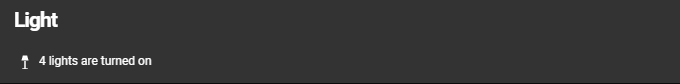

# Homekit Infused
- HKI Framework 3.0.4 or higher required

Back to [Addon List](../addon_list.md)

# Header Templates


### Description
A header template can help you change the subtitle of ANY view (except the frontpage) and have the text change based on the situation. This will make your subtitles a lot more useful.

### Configuration
- To set a template you must open your `../user/config/header_config.yaml` file
- You can ONLY template the subtitle and the icon, do NOT try to template the title!!
- For this to work properly users of HKI 3.0.3 and below MUST update the menu and frontpage button addons (in the original versions)
- For the changes to take effect you must restart Home Assistant
- It is hard to troubleshoot, so the best way to tackle this is to add the templates one by one and restart after each edit. If a template is wrong your lovelace will NOT load! (you will need to fix the error before you can continue from here)

### Examples
```
# example in ../user/config/header_config.yaml

  devices_title: Device
  devices_subtitle: "[[[ if (states['sensor.current_devices_on'].state == 0) return `All devices are turned off`; if (states['sensor.current_devices_on'].state == 1) return `1 device is turned on`; else return `${states['sensor.current_devices_on'].state} devices are turned on`; ]]]"
  
  climate_title: Climate
  climate_subtitle: "[[[ return `The current average temperature is ${states['sensor.average_house_temperature'].state}` ]]]"
```

The same can be done for the subtitle icons!
```
  climate_icon: "[[[ if (states['climate.living_room'].state == "off") return 'mdi:thermostat'; else return 'mdi:heat' ]]]"
```
