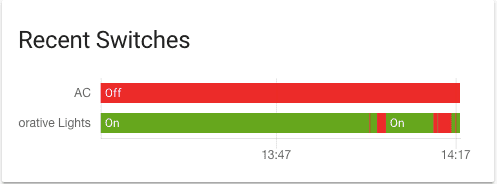
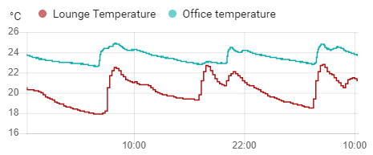

# Homekit Infused 5

## Content
- [Introduction](../index.md)
- [Installation](../installation.md)
- [Configuration](../configuration.md)
- [Addons](../addons.md)
- [Updates](../updates.md)
- [Issues & Questions](../issues.md)
- [About Me](../about.md)
- [Thanks](../thanks.md)

## Addons > History

This addon gives your view a core history card that shows the history of a given entity (or multiple entities), this can be useful for example when you want to track how many times you have opened a specific door.

You can use any of the following options to modify your addon.

### Stack and Addon Config

| Name | Required | Default | Description |
|----------------------------------|-------------|----------------------|-----------------------------------------------------------------------------------------------------------------------------------------------------------------------------------|
| title | no | undefined | Set the title of the stack, ommitting this line will or setting `title: hide` will hide the title |
| entities | yes | list of entities | Set your entity/entities here, you can define more than one entity per card |
| hours_to_show | no | 24 | Set how many hours you want the history card to show |
| refresh_interval | no | 0 | Set the refresh interval rate in `s` |
| [view_layout](layout.md#view-layout) | no | undefined | This is best used in conjunction with the [layout](layout.md#view-layout) addon, but can also be used to control whether to show this stack on different screen sizes. |
| type | no | undefined | Setting a type can make the stack condtional, this option will ONLY accept `conditional` |
| conditions | no | undefined | Add entities and conditions, this will determine when this addon will be shown, e.g. if entity x is turned `on`, then show this addon (see [addons](../addons.md) for examples |


```yaml
# views.yaml (example)
  my_view:
    addons:
      history:
        - title: History
          hours_to_show: 48
          refresh_interval: 60
          entities:
            - sensor.unifi_gateway_mem
            - sensor.memory_use_percent
``` 

### Images:




