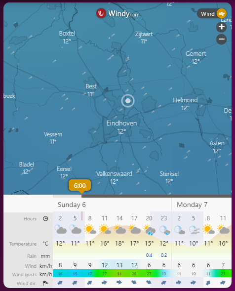

# Homekit Infused

Back to [Addon List](../addon_list.md)

# iFrame


### Description
This is an iFrame to embed a websites in.

### Configuration
- To use this all you need to do is change the URL
- The example below is of a Windy weather card

### Advanced

| Properties | Required | Default | Description |
|----------------------------------|-------------|----------------------------------|----------------------------------------------------------------------------------------------------------------------------------------------------------------------|
| aspect_ratio | no | 125% | Sets the aspect ratio, this MUST be a percentage |
| url | String | yes | Sets the url of the website that needs to be embedded, note that if you use https you can ONLY embed https websites! Also note that not all websites can be embedded. |

### Install
- Create a new file inside the folder of the view you want (e.g. /homekit-infused/user/views/weather/), you can name the file however you want (e.g. iframe-card.yaml)
- Copy the code below and make changes if needed

```
- type: iframe
  style: |
    ha-card {
      position: relative !important;
      overflow: hidden !important;
      border-radius: var(--border-radius) !important;
      box-shadow: var(--box-shadow);
      -webkit-border-radius: var(--border-radius) !important;
      border-radius-x: var(--border-radius) !important;
    }
    iframe {
      border-radius: var(--border-radius) !important;
      -webkit-border-radius: var(--border-radius);
      border-radius-x: var(--border-radius) !important;
      overflow: hidden !important;
    }
  aspect_ratio: 125%
  url: YOUR_URL_HERE
```

### Layout card and horizontal/vertical stacks
I know the HA documentation has this perfectly explained already, but to make it easier on you I will try to explain in more detail [here](../addons/stacks.md)
