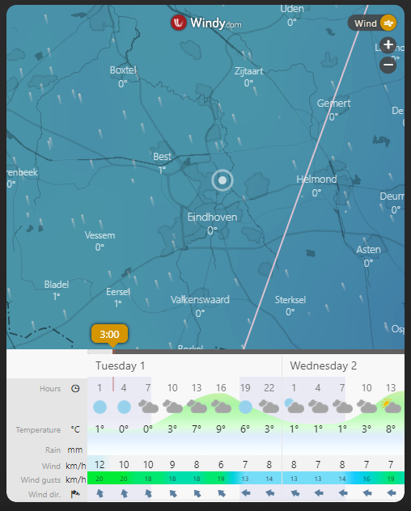

# Homekit Infused 5

## Content
- [Introduction](../index.md)
- [Installation](../installation.md)
- [Configuration](../configuration.md)
- [Addons](../addons.md)
- [Updates](../updates.md)
- [Issues & Questions](../issues.md)
- [About Me](../about.md)
- [Thanks](../thanks.md)

## Addons > iFrame

This addon gives your view an iFrame card .

You can use any of the following options to modify your addon.

### Stack and Addon Config

| Name | Required | Default | Description |
|----------------------------------|-------------|----------------------|-----------------------------------------------------------------------------------------------------------------------------------------------------------------------------------|
| title | no | undefined | Set the title of the stack, ommitting this line will or setting `title: hide` will hide the title |
| url | yes | undefined | Set your iFrame address here, note that if you use `https` to access your Home Assistant, your iFrame address must be `https` as well! |
| aspect_ratio | no | undefined | Set a custom aspect_ratio for this iFrame |
| [view_layout](layout.md#view-layout) | no | undefined | This is best used in conjunction with the [layout](layout.md#view-layout) addon, but can also be used to control whether to show this stack on different screen sizes. |
| type | no | undefined | Setting a type can make the stack condtional, this option will ONLY accept `conditional` |
| conditions | no | undefined | Add entities and conditions, this will determine when this addon will be shown, e.g. if entity x is turned `on`, then show this addon (see [addons](../addons.md) for examples |


```yaml
# views.yaml (example)
  my_view:
    addons:
      iframe: 
        - title: Windy
          url: https://embed.windy.com/
```
```yaml
# views.yaml (example multiple iframes)
  my_view:
    addons:
      iframe: 
        - title: Windy
          url: https://embed.windy.com/
        - title: Buienradar
          url: https://embed.buienradar.nl/
```

### Images:


