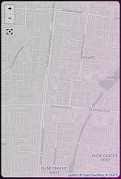

# Homekit Infused

Back to [Addon List](../addon_list.md)

# Map Card


### Description
This is a map card to show the location of person and/or device_trackers.

### Configuration
- To use this you can simply change and/or add person and/or device_tracker entities to the list

### Advanced

| Properties | Required | Default | Description |
|----------------------------------|-------------|----------------------------------|----------------------------------------------------------------------------------------------------------------------------------------------------------------------|
| default_zoom | no | 15 | Sets the default zoom when opening the map |
| aspect_ratio | no | 16x9 | Sets the height/width of the map |
| entities | yes | none | Sets the entities that will be shown on the map |

### Install
- Create a new file inside the folder of the view you want (e.g. /homekit-infused/user/views/location/), you can name the file however you want (e.g. map-card.yaml)
- Copy the code below and make changes if needed

```
- type: horizontal-stack
  cards:
    - !include ../../../base/includes/gap.yaml
    - type: map                    
      style: |
        ha-card {
          --paper-item-icon-color: black;
          color: black;
          border-radius: var(--border-radius);
          box-shadow: var(--box-shadow);
          font-family: Helvetica;
          font-size: 12px;
          opacity: 0.8;
          overflow: hidden;
        }                      
      default_zoom: 15
      aspect_ratio: 4x6
      entities:
        - person.person_1
        - person.person_2
        - person.person_3
    - !include ../../../base/includes/gap.yaml
```

### Layout card and horizontal/vertical stacks
I know the HA documentation has this perfectly explained already, but to make it easier on you I will try to explain in more detail [here](../addons/stacks.md)