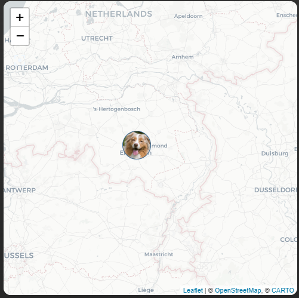

# Homekit Infused 5

## Content
- [Introduction](../index.md)
- [Installation](../installation.md)
- [Configuration](../configuration.md)
- [Addons](../addons.md)
- [Updates](../updates.md)
- [Issues & Questions](../issues.md)
- [About Me](../about.md)
- [Thanks](../thanks.md)

## Addons > Map

This addon gives your view a map that you can use with your own defined entities.

You can use any of the following options to modify your addon.

| Name | Required | Default | Description |
|----------------------------------|-------------|----------------------|-----------------------------------------------------------------------------------------------------------------------------------------------------------------------------------|
| title | no | undefined | Set the title of the stack, ommitting this line will or setting `title: hide` will hide the title |
| default_zoom | no | default | Sets the default zoom, around 15 is probably what you will want for your setup |
| aspect_ratio | no | none | Sets an aspect ratio for your map |
| [view_layout](layout.md#view-layout) | no | undefined | This is best used in conjunction with the [layout](layout.md#view-layout) addon, but can also be used to control whether to show this stack on different screen sizes. |
| dark_mode | no | false | Whether to use a dark or light map |
| entities | yes | array | Add the entities you want in your stack, entities must be listed as an array |

```yaml
# views.yaml (example)
  my_view:
    addons:
      map:
        - title: Location Stephanie
          default_zoom: 15
          aspect_ratio: 16x10
          entities:
            - person.stephanie
```              
```yaml
# views.yaml (example with multiple maps)
  my_view:
    addons:
      map:
        - title: Location Stephanie
          entities:
            - person.stephanie
        - title: Location Jimmy
          entities:
            - person.jimmy
```  
```yaml
# views.yaml (example with multiple entities on single map)
  my_view:
    addons:
      map:
        - title: Location
          entities:
            - person.stephanie
            - person.jimmy
            - person.tala
```  

### Images:


