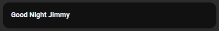

# Homekit Infused 5

## Content
- [Introduction](../index.md)
- [Installation](../installation.md)
- [Configuration](../configuration.md)
- [Addons](../addons.md)
- [Updates](../updates.md)
- [Issues & Questions](../issues.md)
- [About Me](../about.md)
- [Thanks](../thanks.md)

## Addons > Markdown

The Markdown card is used to render Markdown.

The renderer uses [Marked.js](https://marked.js.org/), which supports [several specifications of Markdown](https://marked.js.org/#specifications), including CommonMark, GitHub Flavored Markdown (GFM) and `markdown.pl`.

You can use any of the following options to modify your addon, you can find more examples [here](https://www.home-assistant.io/dashboards/markdown/)

### Stack and Addon Config

| Name | Required | Default | Description |
|----------------------------------|-------------|----------------------|-----------------------------------------------------------------------------------------------------------------------------------------------------------------------------------|
| title | no | undefined | Set the title of the stack, ommitting this line will or setting `title: hide` will hide the title |
| aspect_ratio | no | none | Sets an aspect ratio for your map |
| [view_layout](layout.md#view-layout) | no | undefined | This is best used in conjunction with the [layout](layout.md#view-layout) addon, but can also be used to control whether to show this stack on different screen sizes. |
| conditional | no | false | Setting this to `true` will make the stack condtional |
| conditions | no | undefined | Add entities and conditions, this will determine when this addon will be shown, e.g. if entity x is turned `on`, then show this addon (see [addons](../addons.md) for examples |
| card_size | The algorithm for placing cards aesthetically may have problems with the Markdown card if it contains templates. You can use this value to help it estimate the height of the card in units of 50 pixels (approximately 3 lines of text in default size). (e.g., `4`) |
| entity_id | A list of entity IDs so a template in `content:` only reacts to the state changes of these entities. This can be used if the automatic analysis fails to find all relevant entities. |
| content | yes | undefined | Your markdown text, if you want to use multiline use a `>` or `|` operator (see examples below) |

```yaml
# views.yaml (example single line)
  my_view:
    addons:
      markdown:
        - title: My Markdown Card
          content: Hello World
```              
```yaml
# views.yaml (example with multiple lines)
  my_view:
    addons:
      markdown:
        - title: hide
          content: >
            ## Dashboards
          
            Starting with Home Assistant 0.72, we're experimenting with a new way of defining your interface.
```  
```yaml
# views.yaml (example with jinja)
  my_view:
    addons:
      markdown:
        - title: hide
          content: |
            The lights that are on are:
            
              - {{ l.entity }}
            
```  

### Images:



