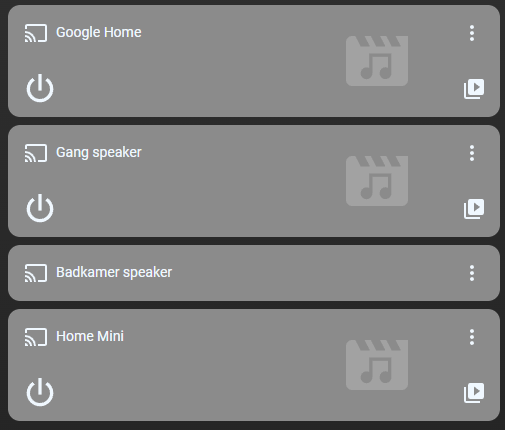

# Homekit Infused 5

## Content
- [Introduction](../index.md)
- [Installation](../installation.md)
- [Configuration](../configuration.md)
- [Addons](../addons.md)
- [Updates](../updates.md)
- [Issues & Questions](../issues.md)
- [About Me](../about.md)
- [Thanks](../thanks.md)

## Addons > Media Player

This addon lets you add some media player cards to your view

You can use any of the following options to modify your addon.

| Name | Required | Default | Description |
|----------------------------------|-------------|----------------------|-----------------------------------------------------------------------------------------------------------------------------------------------------------------------------------|
| title | no | undefined | Set the title of the stack, ommitting this line will or setting `title: hide` will hide the title |
| columns | no | 1 | Define the number of columns this stack will use |
| square | no | false | Set if the media_players should be square or not |
| [view_layout](layout.md#view-layout) | no | undefined | This is best used in conjunction with the [layout](layout.md#view-layout) addon, but can also be used to control whether to show this stack on different screen sizes. |
| entities | yes | list of entities | List all your entities you want to show up here |

### Media Players Extra Options
You can pass any of the options below to your entity to customize the look and feel.

By default you must enter an array of entities like in the examples above. 
You must define your entity as an object instead to make use of the options below. See examples.

| Name | Required | Default | Description |
|----------------------------------|-------------|----------------------|-----------------------------------------------------------------------------------------------------------------------------------------------------------------------------------|
| entity | yes | undefined | Set the entity used |
| name | no | global_name | Set a name for this media-player |

```yaml
# views.yaml (example)
living_room:
  addons:
    media_player:
      - title: Spotify
        type: core
        entities:
          - media_player.spotify_stephanie
          - media_player.spotify_jimmy
```
```yaml
# views.yaml (example multiple stacks)
living_room:
  addons:
    media_player:
      - title: Spotify
        type: core
        entities:
          - media_player.spotify_stephanie
          - media_player.spotify_jimmy
      - title: TV's
        type: core
        entities:
          - media_player.samsung_tv
          - media_player.philips_tv
```

### Images:


