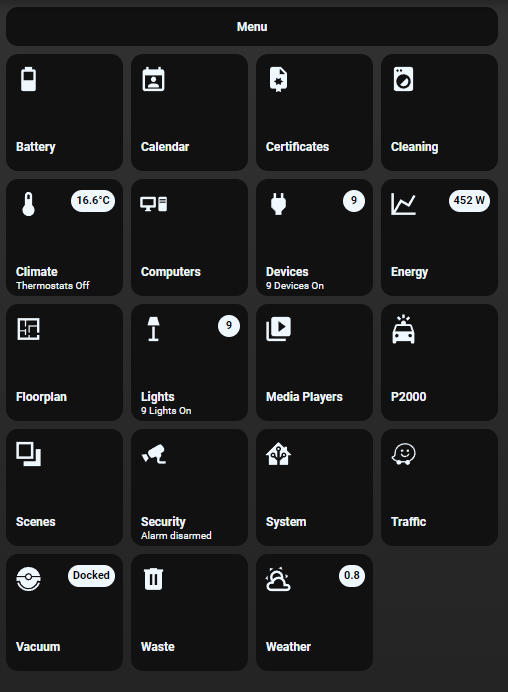

# Homekit Infused 5

## Content
- [Introduction](../index.md)
- [Installation](../installation.md)
- [Configuration](../configuration.md)
- [Addons](../addons.md)
- [Updates](../updates.md)
- [Issues & Questions](../issues.md)
- [About Me](../about.md)
- [Thanks](../thanks.md)

## Addons > Menu

This addon gives your view a button stack with shortcuts to all your views. This addon is installed on the menu view by default, but you can use it anywhere else if you really wanted to.

*Note: this addon will show ALL defined views, if you wish to hide a view from the menu you can add the following to your view.

```yaml
# views.yaml (example)
  my_view:
    show_in_menu: false
```

You can use any of the following options to modify your addon. You MUST use at least one of the settings!

### Stack and Addon Config

| Name | Required | Default | Description |
|----------------------------------|-------------|----------------------|-----------------------------------------------------------------------------------------------------------------------------------------------------------------------------------|
| title | no | undefined | Set the title of the stack, ommitting this line will or setting `title: hide` will hide the title |
| columns | yes/no | 3 | Set how many buttons are shown horizontally |
| [view_layout](layout.md#view-layout) | no | undefined | This is best used in conjunction with the [layout](layout.md#view-layout) addon, but can also be used to control whether to show this stack on different screen sizes. |
| conditional | no | false | Setting this to `true` will make the stack condtional |
| conditions | no | undefined | Add entities and conditions, this will determine when this addon will be shown, e.g. if entity x is turned `on`, then show this addon (see [addons](../addons.md) for examples |

```yaml
# Example
  my_view:
    addons:
      menu:
        - title: Menu
          columns: 3
```
```yaml
# views.yaml (example no title)
  my_view:
    addons:
      menu:
        - columns: 3
# or
  my_view:
    addons:
      menu:
        - title: hide
          columns: 3
```

### Images:


