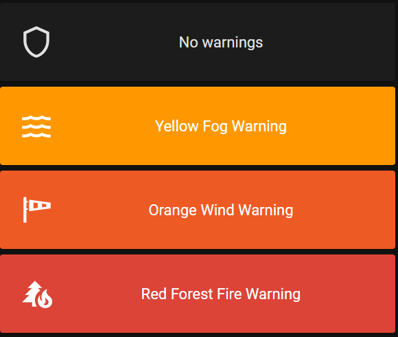

# Homekit Infused 5

## Content
- [Introduction](../index.md)
- [Installation](../installation.md)
- [Configuration](../configuration.md)
- [Addons](../addons.md)
- [Updates](../updates.md)
- [Issues & Questions](../issues.md)
- [About Me](../about.md)
- [Thanks](../thanks.md)

## Addons > MeteoAlarm

A nice weather alerts card for your views.

### HACS Requirements

| Name | Type  | Description |
|----------------------------------|-------------|---------------------------------------------------------------------------------------------------------------------------------------------------------------------------------------------------------|
| [Meteo Alarm Card](https://github.com/MrBartusek/MeteoalarmCard) | Frontend | A card that shows you weather alerts |

You must have setup the meteoalarm integration in Home Assistant (you can do this in the integrations section of Home Assistant)

You can use any of the following options to modify your addon.

| Name | Required | Default | Description |
|----------------------------------|-------------|----------------------|-----------------------------------------------------------------------------------------------------------------------------------------------------------------------------------|
| title | no | undefined | Set the title of the stack, ommitting this line will or setting `title: hide` will hide the title |
| [view_layout](layout.md#view-layout) | no | undefined | This is best used in conjunction with the [layout](layout.md#view-layout) addon, but can also be used to control whether to show this stack on different screen sizes. |
| entity | yes | unknown | The entity to use, this MUST have weather alerts in its attributes! |
| integration | no | automatic | Name of the integration. Available options: <ul><li>`automatic`</li><li>`meteoalarm`</li><li>`meteofrance`</li><li>`dwd`</li><li>`weatheralerts`</li></ul> |

```yaml
# views.yaml (example)
  my_view:
    addons:
      meteoalarm:
        - title: My Weather Alerts
          entity: binary_sensor.meteoalarm
          integration: weatheralerts
```

### Images:


