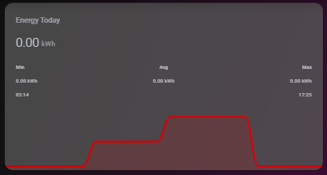

# Homekit Infused

Back to [Addon List](../addon_list.md)

# Mini Graph Card
*Homekit Infused Framework 3.0.3 or higher required




### Description
This is a good looking mini-graph-card that you can use in your setup, it has been templated like other addons for ease of use.

### Requirements (HACS)
| Name | Type  | Description |
|----------------------------------|-------------|---------------------------------------------------------------------------------------------------------------------------------------------------------------------------------------------------------|
| [Mini Graph Card](https://github.com/kalkih/mini-graph-card) | Frontend | This is an elegant mini-graph-card for creating cards with graphs and bars |

### Resources
Add the following line to your lovelace resources 
```/hacsfiles/mini-graph-card/mini-graph-card-bundle.js```

### Configuration
- To use this create a card as in the example below, all paramaters that have a default are not required (see examples)

### Advanced
| Parameters | Type | Default | Description |
|----------------------------------|-------------|----------------------------------|----------------------------------------------------------------------------------------------------------------------------------------------------------------------|
| entity | String | none | Sets the entity used for the graph, unfortunately templating only works when using a single entity, if you want a card that shows multiple entities visit https://github.com/kalkih/mini-graph-card for more information (this card must be created by yourself) |
| name | String | none | Sets the name of the card |
| points_per_hour | Integer | 2 | Sets the points measured per hour |
| line_width | Integer | 3 | Sets the line/bar width of the card |
| hour24 | Boolean | true | Show 12 or 24 hours |
| animate | Boolean | true | Animate the line when opening the card |
| decimals | Integer | 1 | Amount of decimals shown |
| font_size | Integer | 53 | Sets the font size of the card |
| height | Integer | 90 | Sets the height of the card |
| graph_type | String | line | Sets the card to have a `graph` or a `bar`|
| show_icon | Boolean | false | Show icon on the card |
| show_fill | Boolean | true | Fills the line with the same color |
| show_extrema | Boolean | false | Show extra information like high/low on the card |
| show_average | Boolean | false | Show average on the card |
| font_size_header | Integer | 9 | Sets the header font size |
| line_color | String | red | Sets the color of the line/bar |

### Install
- Create a new file inside the folder of the view you want (e.g. /homekit-infused/user/views/energy/), you can name the file however you want (e.g. mini-graph-card.yaml)
- Copy the code below and make changes if needed

*Minimum required options
```
- type: horizontal-stack
  cards:
    - !include ../../../base/includes/gap.yaml
    - !include
      - '../../../base/templates/other/mini-graph.yaml'
      - entity: sensor.daily_energy
        name: Energy Today
    - !include ../../../base/includes/gap.yaml
```

*Full options
```
- type: horizontal-stack
  cards:
    - !include ../../../base/includes/gap.yaml
    - !include
      - '../../../base/templates/other/mini-graph.yaml'
      - entity: sensor.daily_energy
        name: Energy Today
        points_per_hour: 2
        line_width: 3
        hour24: true
        animate: true
        decimals: 2
        font_size: 53
        height: 90
        graph_type: line
        show_icon: false
        show_fill: true
        show_extrema: true
        show_average: true
        font_size_header: 9
        line_color: red
    - !include ../../../base/includes/gap.yaml
```

