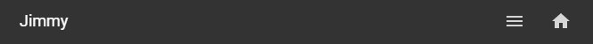

# Homekit Infused

Back to [Addon List](../addon_list.md)

# Navigation Bar


### Description
HKI has a navigation bar (v3.6.1 or higher) and has limited customizability.
Note that the navigation bar is mostly done through CSS and is just the original tab header that has been styled. Because of this the options I can give you through this are somewhat limited!

### Navigation Bar Settings (v3.6.2 and higher)
From v3.6.2 or higher there are new options for the navigation bar. Changes in this menu are instant!
You can find the settings for the navigation bar inside the HKI Settings accessed through the UI (Menu > HKI Settings > Theme Settings).

Available Options:
- Set if HKI navigation bar is enabled/disabled
- Set the location of the HKI navigation bar (top or bottom)
- Set icons left or right (this will also move the text/clock/date/username)
- Set to show the currently logged in user, the date, a clock or to hide entirely (useful if you want a navigation bar with a lot of icons)

*Note: When using multiple dashboards, when the navigation_bar option is enabled this is persistent on ALL dashboards, this means that the settings you apply to the navigation bar will also be applied to any other dashboard you might have, when the HKI navigation bar is enabled it will also remove the sidebar button!!! This won't affect the functionality of the navigation bar, though note that if you had set it to e.g. bottom mode, it will also be on the bottom on any other dashboard you may have. The same is true when applied as a top navigation. Note that you might want to turn the HKI navigation bar off if it conflicts with your other dashboards.

### Configuration
- To edit the footer you will need to open the `/homekit-infused/user/config/` folder and open the `navigation_bar.yaml` file.
- The `home` button is fixed and can not be moved/removed
- You can ONLY set `true` or `false` for each view you want to show
- Icons are placed from left to right, you can NOT change the order of the icons, you can however choose whatever view you want with the exception of settings.
- When the footer is set to right-handed mode, the icons are placed from right to left!!
- You can also change the icon for every view that is shown in the footer within this file
- The settings will be read from top to bottom, see examples below.
- Remember that changes to this file requires a restart of Home Assistant

### Example Right Handed
Since the `home` and `menu` buttons are always present I will try to explain how this works
```
  lights_view: false
  devices_view: false
  climate_view: true
  security_view: false
  automations_view: true
```
In the example above you will have a footer in the following order:
`text   -   automations   -   climate   -   menu   -   home`

Remember that I said that the footer in right handed mode should be read from right to left (as opposed to reading from left to right) and that the order of the icons can be read from top to bottom in the config.
In this case this means the climate_view is the first view with the attribute `true` and will be the first icon to show in the footer from right to left. Since the home and menu buttons are fixed, the climate button will appear to the left of those buttons.
It's hard to explain so here is another example
```
  lights_view: true
  devices_view: false
  climate_view: true
  security_view: false
  automations_view: true
```
In the example above you will have a footer in the following order:
`text   -   automations   -   climate   -   lights   -   menu   -   home`

### Example Left Handed
Since the `home` and `menu` buttons are always present I will try to explain how this works
```
  lights_view: false
  devices_view: false
  climate_view: true
  security_view: false
  automations_view: true
```
In the example above you will have a footer in the following order:
`home   -   menu   -   climate   -   automations   -   text`

Left handed users can simply read the icons from left to right, since we don't need to apply tricks on the footer to make the icons appear on the left side, this is because they are at this location by default in Home Assistant.
In this case this means the climate_view is the first view with the attribute `true` and will be the first icon to show in the footer from left to right. Since the home and menu buttons are fixed, the climate button will appear to the right of those buttons.
It's hard to explain so here is another example
```
  lights_view: true
  devices_view: false
  climate_view: true
  security_view: false
  automations_view: true
```
In the example above you will have a footer in the following order:
`home   -   menu   -   lights   -   climate   -   automations   -   text`

### Information
Note that changing the order of the config has NO effect on the order of the navigation bar. Like mentioned before the footer icons can NOT be arranged!
