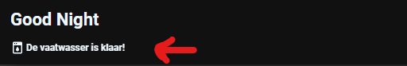

# Homekit Infused 5

## Content
- [Introduction](../index.md)
- [Installation](../installation.md)
- [Configuration](../configuration.md)
- [Addons](../addons.md)
- [Updates](../updates.md)
- [Issues & Questions](../issues.md)
- [About Me](../about.md)
- [Thanks](../thanks.md)

## Notifications

This card will show you live notifications in the subtitle part of the header. If you have multiple notifications, they will automatically slide and show you each notification for a few seconds. You could also swipe through them.

- To create a notification you will have to open the following file `/homekit-infused/user/notifications.yaml`
- You will first need to create a conditional card and then put the notification card inside of it. The state of the defined condition will decide to show the notification or not. See examples below.

```yaml
# notifications.yaml (example)
- type: conditional
  conditions:
    - entity: binary_sensor.smoke_sensor
      state: "on"
  card:
    !include
    - '../hki-base/templates/header/subtitle-notification-template.yaml'
    - icon: mdi:smoke-detector
      name: There is smoke detected in the Kitchen!!
      spin: true
```

### Notification Extra Options

| Properties | Required | Default | Description |
|----------------------------------|-------------|----------------------------------|----------------------------------------------------------------------------------------------------------------------------------------------------------------------|
| icon | yes | none | Sets an icon to show with the notification, this accepts [JS templates](https://github.com/custom-cards/button-card#javascript-templates) |
| name | yes | none | Sets the notification, this accepts [JS templates](https://github.com/custom-cards/button-card#javascript-templates) |
| spin | no | false | Sets if the icon should spin when showing the notification |
| tap_action | no | undefined | Set a specific tap_action for this notification see [here](https://github.com/custom-cards/button-card#Action) for available options |
| hold_action | no | undefined | Set a specific hold_action for this notification see [here](https://github.com/custom-cards/button-card#Action) for available options |
| double_tap_action | no | undefined | Set a specific double_tap_action for this notification see [here](https://github.com/custom-cards/button-card#Action) for available options |

```yaml
# notifications.yaml (example multiple notifications)

# Smoke Detector
- type: conditional
  conditions:
    - entity: binary_sensor.smoke_sensor
      state: "on"
  card:
    !include
    - '../hki-base/templates/header/subtitle-notification-template.yaml'
    - icon: mdi:smoke-detector
      name: There is smoke detected in the Kitchen!!
      spin: true

# Front Door
- type: conditional
  conditions:
    - entity: binary_sensor.front_door
      state: "on"
  card:
    !include
    - '../hki-base/templates/header/subtitle-notification-template.yaml'
    - icon: mdi:door
      name: The frontdoor is open!!
```

```yaml
# example multiple notifications with an all clear notification

# All Clear
- type: conditional
  conditions:
    - entity: binary_sensor.smoke_sensor
      state: "off"
    - entity: binary_sensor.smoke_sensor
      state: "off"
  card:
    !include
    - '../hki-base/templates/header/subtitle-notification-template.yaml'
    - icon: mdi:check-box-outline
      name: All clear, no notifications.
      
# Smoke Detector
- type: conditional
  conditions:
    - entity: binary_sensor.smoke_sensor
      state: "on"
  card:
    !include
    - '../hki-base/templates/header/subtitle-notification-template.yaml'
    - icon: mdi:smoke-detector
      name: There is smoke detected in the Kitchen!!
      spin: true

# Front Door
- type: conditional
  conditions:
    - entity: binary_sensor.front_door
      state: "on"
  card:
    !include
    - '../hki-base/templates/header/subtitle-notification-template.yaml'
    - icon: mdi:door
      name: The frontdoor is open!!
```

### Extra Information
For more examples you can check out my personal notifications.yaml file [here](https://github.com/jimz011/homekit-infused/blob/5.x.x-personal/hki-user/notifications.yaml)

### Images:


