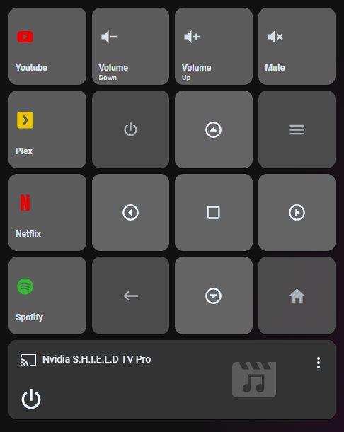

# Homekit Infused

Back to [Addon List](../addon_list.md)

# Remote Control (Nvidia SHIELD TV/Android TV/Apple TV)



### Description
This is a predefined remote control solution for your Android or Apple TV. The remote has been preconfigured for Android but can be changed to suit the needs for Apple TV's. Note that you must have either an Android TV or Apple TV setup already in your Home Assistant config.

*Note Android: The mute button might not work as intended!
*Note Apple: The shortcuts can NOT be used at the time of writing, this might change in the future but it depends on the developer of the ATV component to add this feature. I will make a dedicated ATV remote in the future. For now you can use this!

### Configuration
- Configurating this addon is fairly simple and only requires a few properties for an Android TV
- If using an Apple TV, please change the commands to use [these](https://www.home-assistant.io/integrations/apple_tv/#remote) ones instead 

### Advanced

| Properties | Required | Default | Description |
|----------------------------------|-------------|----------------------------------|----------------------------------------------------------------------------------------------------------------------------------------------------------------------|
| entity_media_player | yes | none | This can be your Android or Apple TV entity! |
| entity_media_player_remote | yes | none | When using an Apple remote you must use the remote entity, for Android TV just use the same entity as above! |
| entity_media_player_sound | yes | none | You can use this if you use a different media_player to control sound (this MUST be an entity in the media_player domain!). If you don't have a separate media_player for sound you must enter the same entity as above |
| service | no | androidtv.adb_command | The service to call when one of the remote buttons are pressed, use `remote.your_apple_tv` when using an Apple TV |
| command_up | no | UP | The command to send when the `up` arrow is pressed, use `up` for Apple TV (note that this is in lowercase!) |
| command_menu | no | MENU | The command to send when the `menu` button is pressed, use `menu` for Apple TV (note that this is in lowercase!) |
| command_left | no | LEFT | The command to send when the `left` arrow is pressed, use `left` for Apple TV (note that this is in lowercase!) |
| command_center | no | CENTER | The command to send when the `center` button is pressed, use `select` for Apple TV (note that this is in lowercase!) |
| command_right | no | RIGHT | The command to send when the `right` arrow is pressed, use `right` for Apple TV (note that this is in lowercase!) |
| command_back | no | BACK | The command to send when the `back` button is pressed, use `menu` for Apple TV (note that this is in lowercase!) |
| command_down | no | DOWN | The command to send when the `down` arrow is pressed, use `down` for Apple TV (note that this is in lowercase!) |
| command_home | no | HOME | The command to send when the `home` button is pressed, use `top_menu` for Apple TV (note that this is in lowercase!) |
||||
| name_volume_down | no | Volume | Change the volume down name |
| label_volume_down | no | Down | Change the volume down label |
| icon_volume_down | no | mdi:volume-minus | Change the default volume down icon |
||||
| name_volume_up | no | Volume | Change the volume up name |
| label_volume_up | no | Down | Change the volume up label |
| icon_volume_up | no | mdi:volume-plus | Change the default volume up icon |
||||
| name_volume_mute | no | Volume | Change the volume mute name |
| label_volume_mute | no | Down | Change the volume mute label |
| icon_volume_mute | no | mdi:volume-mute | Change the default volume mute icon |
||||
| name_preset_button_1 | no | Youtube | Change the name of the first preset button |
| icon_preset_button_1 | no | mdi:youtube | Change the icon of the first preset button |
| icon_color_preset_button_1 | no | red | Change the icon color of the first preset button, this can also be a hex or rgb value |
| source_preset_button_1 | no | YouTube | Change the source of the first preset button, this is usually the app name (case-sensitive), if you need help finding sources check [here](https://community.home-assistant.io/t/native-support-for-android-tv-android-devices/82792/485) |
||||
| name_preset_button_2 | no | Plex | Change the name of the second preset button |
| icon_preset_button_2 | no | mdi:plex | Change the icon of the second preset button |
| icon_color_preset_button_2 | no | gold | Change the icon color of the second preset button, this can also be a hex or rgb value |
| source_preset_button_2 | no | Plex | Change the source of the second preset button, this is usually the app name (case-sensitive), if you need help finding sources check [here](https://community.home-assistant.io/t/native-support-for-android-tv-android-devices/82792/485) |
||||
| name_preset_button_3 | no | Netflix | Change the name of the third preset button |
| icon_preset_button_3 | no | mdi:netflix | Change the icon of the third preset button |
| icon_color_preset_button_3 | no | red | Change the icon color of the third preset button, this can also be a hex or rgb value |
| source_preset_button_3 | no | Netflix | Change the source of the third preset button, this is usually the app name (case-sensitive), if you need help finding sources check [here](https://community.home-assistant.io/t/native-support-for-android-tv-android-devices/82792/485) |
||||
| name_preset_button_4 | no | Spotify | Change the name of the fourth preset button |
| icon_preset_button_4 | no | mdi:spotify | Change the icon of the fourth preset button |
| icon_color_preset_button_4 | no | limegreen | Change the icon color of the fourth preset button, this can also be a hex or rgb value |
| source_preset_button_4 | no | Spotify | Change the source of the fourth preset button, this is usually the app name (case-sensitive), if you need help finding sources check [here](https://community.home-assistant.io/t/native-support-for-android-tv-android-devices/82792/485) |
||||
| grid | no | default-hki-grid | Change the grid of the button, choose from `default-hki-grid`, `light-devices-grid`, `old-hki-grid` or `old-light-devices-grid` |

### Install
- Create a new file inside the folder of the view you want (e.g. /homekit-infused/user/views/frontpage/), you can name the file however you want (e.g. frontpage-buttons.yaml)
- Copy the code below and make changes if needed

```
# example of minimal required config for Android TV
- !include
  - '../../../base/templates/other/remote-control.yaml'
  - entity_media_player: media_player.nvidia_s_h_i_e_l_d_tv_pro
    entity_media_player_remote: media_player.nvidia_s_h_i_e_l_d_tv_pro
    entity_media_player_sound: media_player.samsung_ue65ku6000
```
```
# example of minimal required config for Apple TV
- !include
  - '../../../base/templates/other/remote-control.yaml'
  - entity_media_player_sound: media_player.samsung_ue46es5500
    entity_media_player: media_player.slaapkamer
    entity_media_player_remote: remote.slaapkamer
    service: remote.send_command
    command_up: up
    command_menu: menu
    command_left: left
    command_center: select
    command_right: right
    command_back: menu
    command_down: down
    command_home: top_menu
```
