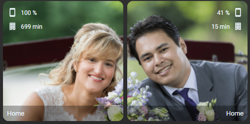
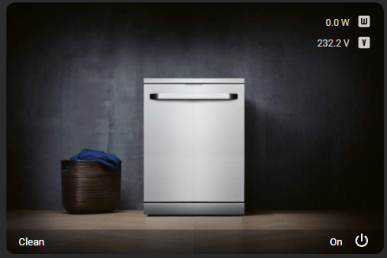

# Homekit Infused 5

## Content
- [Introduction](../index.md)
- [Installation](../installation.md)
- [Configuration](../configuration.md)
- [Addons](../addons.md)
- [Updates](../updates.md)
- [Issues & Questions](../issues.md)
- [About Me](../about.md)
- [Thanks](../thanks.md)

## Addons > Picture Elements

This addon gives your view a core picture elements card with ALL of the options available.

You can use any of the following options to modify your addon.

### Stack Config

| Name | Required | Default | Description |
|----------------------------------|-------------|----------------------|-----------------------------------------------------------------------------------------------------------------------------------------------------------------------------------|
| title | no | undefined | Set the title of the stack, ommitting this line will or setting `title: hide` will hide the title |
| [view_layout](layout.md#view-layout) | no | undefined | This is best used in conjunction with the [layout](layout.md#view-layout) addon, but can also be used to control whether to show this stack on different screen sizes. |
| type | no | undefined | Setting a type can make the stack condtional, this option will ONLY accept `conditional` |
| conditions | no | undefined | Add entities and conditions, this will determine when this addon will be shown, e.g. if entity x is turned `on`, then show this addon (see [addons](../addons.md) for examples |
| columns | no | 2 | Set how many picture elements should be placed horizontally |
| cards | yes | list of entities | Set your cards here |

### Picture Elements Extra Options

| Name | Required | Default | Description |
|----------------------------------|-------------|----------------------|-----------------------------------------------------------------------------------------------------------------------------------------------------------------------------------|
| image | yes/no | undefined | A background image for your elements card, you must either use this or `camera_image` |
| camera_image | yes/no | undefined | Use a camera feed instead of an image, you must either use this or `image` |
| camera_view | no | auto | Set whether to show a live view of the camera feed, choose between `auto` or `live` |
| [state_filter](https://www.home-assistant.io/lovelace/picture-elements/#how-to-use-state_filter) | no | undefined | Set state based  CSS filters, [click here](https://www.home-assistant.io/lovelace/picture-elements/#how-to-use-state_filter) for more information |
| [elements](https://www.home-assistant.io/lovelace/picture-elements/#elements) | yes | undefined | Set which elements to show, [click here](https://www.home-assistant.io/lovelace/picture-elements/#elements) for more information |

The documentation on this page is only an example to set it up, however you can use all the options available in the [OFFICIAL DOCUMENTATION](https://www.home-assistant.io/lovelace/picture-elements/#elements).


```yaml
# views.yaml (example with extra features)
  my_view:
    addons:
      picture_elements:
        - title: hide
          columns: 2
          cards:
            - image: /local/images/stephanie_small.png
              elements:
                - type: image
                  entity: person.stephanie
                  image: /local/images/stephanie_small.png
                  tap_action:
                    action: navigate
                    navigation_path: stephanie
                  hold_action:
                    action: none
                  style:
                    left: 50%
                    top: 50%
                    width: 100%
                    heigth: 100%
                  filter: grayscale(100%)
                  state_filter:
                    "home": revert
                - type: state-label
                  entity: person.stephanie
                  style:
                    left: 0
                    bottom: 0
                    pointer-events: none
                    font-size: 13px
                    font-family: var(--font-family)
                    line-height: 15px
                    color: AliceBlue
                    background-color: rgba(0, 0, 0, 0.3)
                    width: 100%
                    transform: initial
                    text-align: left
``` 

### Extra Information 

Previously the persons addon was made out of this card, the persons addon was easy to use but very very limited. Since I imagine some people would still like to implement it in their setups, here is the code to do that with this addon.

```yaml
# views.yaml (example of the now deprecated persons addon)
  my_view:
    addons:
      picture_elements:
        - title: hide
          columns: 2
          cards:
            - image: /local/images/stephanie_small.png
              elements:   
                - type: image
                  entity: person.stephanie
                  image: /local/images/stephanie_small.png
                  tap_action:
                    action: navigate
                    navigation_path: stephanie
                  hold_action:
                    action: none
                  style:
                    left: 50%
                    top: 50%
                    width: 100%
                    heigth: 100%
                  filter: grayscale(100%)
                  state_filter:
                    "home": revert
                - type: state-label
                  entity: person.stephanie
                  style:
                    left: 0
                    bottom: 0
                    pointer-events: none
                    font-size: 13px
                    font-family: var(--font-family)
                    line-height: 15px
                    color: AliceBlue
                    background-color: rgba(0, 0, 0, 0.3)
                    width: 100%
                    transform: initial
                    text-align: left
                - type: state-label
                  entity: sensor.sm_n986b_battery_level
                  style:
                    top: 0
                    left: 0
                    pointer-events: none
                    transform: initial
                    font-size: 12px
                    font-family: var(--font-family)
                    color: AliceBlue
                    line-height: 32px
                    padding: 0px 28px
                - type: icon
                  icon: mdi:cellphone
                  style:
                    top: 0
                    left: 0
                    pointer-events: none
                    transform: scale(0.8)
                    color: AliceBlue
                    line-height: 32px
                    padding: 7px 7px
                    font-size: 11px
                    font-family: var(--font-family)
                - type: conditional
                  conditions:
                    - state: "home"
                      entity: person.stephanie
                  elements:
                    - type: state-label
                      entity: sensor.reistijd_stephanie_work
                      style:
                        top: 0
                        left: 0
                        pointer-events: none
                        transform: initial
                        font-size: 12px
                        font-family: var(--font-family)
                        color: AliceBlue
                        line-height: 32px
                        padding: 28px 28px
                    - type: icon
                      icon: mdi:office-building
                      style:
                        top: 0
                        left: 0
                        pointer-events: none
                        transform: scale(0.8)
                        color: AliceBlue
                        line-height: 32px
                        padding: 35px 7px
                        font-size: 11px  
                        font-family: var(--font-family)
                - type: conditional
                  conditions:
                    - state_not: "home"
                      entity: person.stephanie
                  elements:
                    - type: state-label
                      entity: sensor.reistijd_stephanie
                      style:
                        top: 0
                        left: 0
                        pointer-events: none
                        transform: initial
                        font-size: 12px
                        font-family: var(--font-family)
                        color: AliceBlue
                        line-height: 32px
                        padding: 28px 28px
                    - type: icon
                      icon: mdi:home
                      style:
                        top: 0
                        left: 0
                        pointer-events: none
                        transform: scale(0.8)
                        color: AliceBlue
                        line-height: 32px
                        padding: 35px 7px
                        font-size: 11px  
                        font-family: var(--font-family)
            - image: /local/images/jimmy_small.png
              elements:
                - type: image
                  entity: person.jimmy
                  image: /local/images/jimmy_small.png
                  tap_action:
                    action: navigate
                    navigation_path: jimmy
                  hold_action:
                    action: none
                  style:
                    left: 50%
                    top: 50%
                    width: 100%
                    heigth: 100%
                  filter: grayscale(100%)
                  state_filter:
                    "home": revert
                - type: state-label
                  entity: person.jimmy
                  style:
                    left: 0
                    bottom: 0
                    pointer-events: none
                    font-size: 13px
                    font-family: var(--font-family)
                    line-height: 15px
                    color: AliceBlue
                    background-color: rgba(0, 0, 0, 0.3)
                    width: 100%
                    transform: initial
                    text-align: right
                - type: state-label
                  entity: sensor.z_fold_3_jimmy_battery_level
                  style:
                    top: 0
                    right: 0
                    pointer-events: none
                    transform: initial
                    font-size: 12px
                    font-family: var(--font-family)
                    color: AliceBlue
                    line-height: 32px
                    padding: 0px 28px
                - type: icon
                  icon: mdi:cellphone
                  style:
                    top: 0
                    right: 0
                    pointer-events: none
                    transform: scale(0.8)
                    color: AliceBlue
                    line-height: 32px
                    padding: 7px 7px
                    font-size: 11px
                    font-family: var(--font-family)
                - type: conditional
                  conditions:
                    - state: "home"
                      entity: person.jimmy
                  elements:
                    - type: state-label
                      entity: sensor.reistijd_jimmy_work
                      style:
                        top: 0
                        right: 0
                        pointer-events: none
                        transform: initial
                        font-size: 12px
                        font-family: var(--font-family)
                        color: AliceBlue
                        line-height: 32px
                        padding: 28px 28px
                    - type: icon
                      icon: mdi:office-building
                      style:
                        top: 0
                        right: 0
                        pointer-events: none
                        transform: scale(0.8)
                        color: AliceBlue
                        line-height: 32px
                        padding: 35px 7px
                        font-size: 11px  
                        font-family: var(--font-family)
                - type: conditional
                  conditions:
                    - state_not: "home"
                      entity: person.jimmy
                  elements:
                    - type: state-label
                      entity: sensor.reistijd_jimmy
                      style:
                        top: 0
                        right: 0
                        pointer-events: none
                        transform: initial
                        font-size: 12px
                        font-family: var(--font-family)
                        color: AliceBlue
                        line-height: 32px
                        padding: 28px 28px
                    - type: icon
                      icon: mdi:home
                      style:
                        top: 0
                        right: 0
                        pointer-events: none
                        transform: scale(0.8)
                        color: AliceBlue
                        line-height: 32px
                        padding: 35px 7px
                        font-size: 11px  
                        font-family: var(--font-family)
``` 

Wow that is a lot of code (well yes the persons addon was just as much code :P ). Is there a way to clean it up a bit?
Sure, you can split the code into multiple files (which is what I did). I have put all the elements into a file and in a separate folder.

```yaml
# views.yaml
  my_view:
    addons:
      picture_elements:
        - title: hide
          columns: 2
          cards:
            - image: /local/images/stephanie_small.png
              elements:
                !include ../elements/frontpage-photo-stephanie.yaml
            - image: /local/images/jimmy_small.png
              elements:
                !include ../elements/frontpage-photo-jimmy.yaml
```

You can find examples of how I did this [here](https://github.com/jimz011/homekit-infused/tree/5.x.x-personal/hki-user/elements)

### Images:




