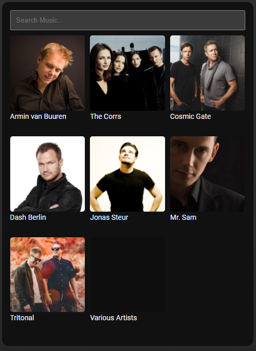

# Homekit Infused 5

## Content
- [Introduction](../index.md)
- [Installation](../installation.md)
- [Configuration](../configuration.md)
- [Addons](../addons.md)
- [Updates](../updates.md)
- [Issues & Questions](../issues.md)
- [About Me](../about.md)
- [Thanks](../thanks.md)

## Addons > Plex

Plex for Home Assistant

### HACS Requirements

| Name | Type  | Description |
|----------------------------------|-------------|---------------------------------------------------------------------------------------------------------------------------------------------------------------------------------------------------------|
| [Plex Meets Home Assistant](https://github.com/JurajNyiri/PlexMeetsHomeAssistant) | Frontend | A very nice card to search and start movies/series on your devices that support Plex |

It is HIGHLY recommended that you setup the Plex integration before using this card, it is not required but it will make the experience a lot better.

You can use any of the following options to modify your addon.

### Stack and Addon Config

| Name | Required | Default | Description |
|----------------------------------|-------------|----------------------|-----------------------------------------------------------------------------------------------------------------------------------------------------------------------------------|
| title | no | undefined | Set the title of the stack, ommitting this line will or setting `title: hide` will hide the title |
| [view_layout](layout.md#view-layout) | no | undefined | This is best used in conjunction with the [layout](layout.md#view-layout) addon, but can also be used to control whether to show this stack on different screen sizes. |
| conditional | no | false | Setting this to `true` will make the stack condtional |
| conditions | no | undefined | Add entities and conditions, this will determine when this addon will be shown, e.g. if entity x is turned `on`, then show this addon (see [addons](../addons.md) for examples |
| plex_token | yes | unknown | Your plex token, if you want to know how to get your plex token [click here](https://support.plex.tv/articles/204059436-finding-an-authentication-token-x-plex-token/) |
| plex_ip | yes | unknown | The ip of your plex server |
| plex_port | no | 32400 | The port of your plex server, by default it will use 32400 |
| libraryName | yes | movies | The name of the library to show in this card, this must match the library name you have used on your Plex Server |
| protocol | no | http | Set if you should connect over `http` or `https`, if you connect with Home Assistant through `https` you MUST have plex available over `https` as well! |
| maxCount | no | 10 | How many items to show per page |
| android_tv | no | optional | Set an Android TV entity, this will be used as media player |
| kodi | no | optional | Set a Kodi entity, this will be used as media player |
| plex_player | no | optional | Set an Plex PLayer entity, This can be any plex entity. This will be used as media player |

```yaml
# views.yaml (example with extra options)
  my_view:
    addons:
      plex:
        - title: Movies
          plex_token: !secret plex_token
          plex_ip: !secret plex_url
          plex_port: 443
          protocol: https
          library_name: Movies
          android_tv: media_player.nvidia_s_h_i_e_l_d_tv_pro
        - title: Series
          plex_token: !secret plex_token
          plex_ip: !secret plex_url
          plex_port: 443
          protocol: https
          library_name: TV Series
          android_tv: media_player.nvidia_s_h_i_e_l_d_tv_pro
```

### Images:


