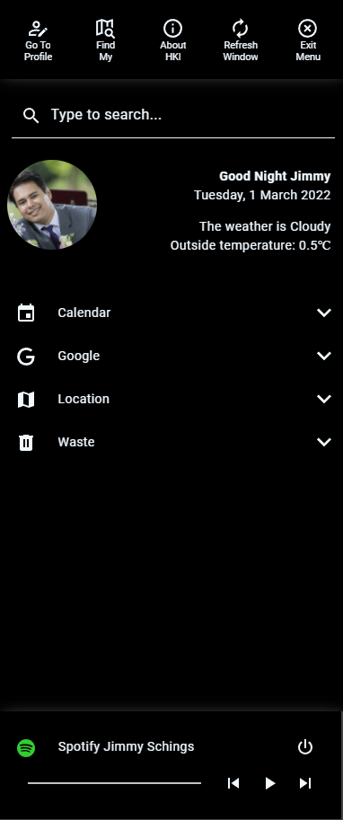
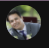

# Homekit Infused 5

## Content
- [Introduction](../index.md)
- [Installation](../installation.md)
- [Configuration](../configuration.md)
- [Addons](../addons.md)
- [Updates](../updates.md)
- [Issues & Questions](../issues.md)
- [About Me](../about.md)
- [Thanks](../thanks.md)

## Profile

HKI comes with a profile menu with shortcut buttons. The middle section and the media player are fully customizable, you can use any card you want.
Every stack of cards will automatically be filled inside of a dropdown menu!

To make the most out of this menu you should add an entity_picture to your person entities!

NOTE: There are 12 shortcut buttons in the top bar, for non admins only 4 shortcuts are shown!
WARNING: You should NOT use JS templates in cards on this view, or your profile button will no longer render! Cards that support Jinja CAN be used!

The settings on this page MUST be configured in `/hki-user/config/config.yaml`!

#### Tips & Tricks

To get the best out of the profile menu I will suggest using a [state-switch](https://github.com/thomasloven/lovelace-state-switch), this way you can have the profile menu show different cards depending on the user.

#### Profile Options 

| Name | Required | Default | Description |
|----------------------------------|-------------|----------------------|-----------------------------------------------------------------------------------------------------------------------------------------------------------------------------------|
| markdown | no | unknown | Set some text to use in the profile menu, this will be shown right from your profile picture |
| media_player | no | unknown | Choose a media_player to show at the bottom of the profile menu |
| translate | no | undefined | Translate some of the static stuff in the HKI Profile menu, for performance reasons ONLY the buttons that are shown to ALL users can be edited. Buttons that are shown for admins can NOT be translated! |
| cards | no | unknown | Set stacks with cards, see Extra Options below |

```yaml
# config.yaml (example profile markdown)
  profile:
    markdown: >
      **{{ states('sensor.greeting') }} {{ user|capitalize }}**
    
      {{ state_attr('sensor.pretty_date', 'week_day') }}, {{ states('sensor.pretty_date') }}
```
```yaml
# config.yaml (example spotify media_player for multiple users)
  profile:
    media_player:
      type: custom:state-switch
      entity: user
      states:
        Jimmy:
          type: custom:mini-media-player
          card_mod:
            style: |
              :host {
                --ha-card-background: black !important;
              }
          entity: media_player.spotify_jimmy
          artwork: cover
          hide:
            source: true
            power_state: true
        Stephanie:
          type: custom:mini-media-player
          card_mod:
            style: |
              :host {
                --ha-card-background: black !important;
              }
          entity: media_player.spotify_jimmy
          artwork: cover
          hide:
            source: true
            power_state: true
```
#### Profile Cards Extra Options

| Name | Required | Default | Description |
|----------------------------------|-------------|----------------------|-----------------------------------------------------------------------------------------------------------------------------------------------------------------------------------|
| title | yes | unknown | Set a title for this stack |
| icon | yes | unknown | Set an icon for this stack |
| padding | no | -5 | Sets the indentation in which the cards in the dropdown menu will be shown. `-5` is flush with the dropdown title itself. |
| open | no | false | If set to `true` this category will always be collapsed/open when the popup opens |
| cards | yes | list of cards | Define your cards in here, you can use ALL options of the entities card addon! |

#### Cards Information

Cards are ALWAYS placed inside an entities card and will always be folded in a fold-entity-row. This means that you MUST start any card as if it were a card in an [entities card](https://www.home-assistant.io/lovelace/entities/). The options above will change the appearance of the fold-entity-row. 

```yaml
# config.yaml (example cards)
  profile:
    cards:
      - title: Calendar 
        icon: mdi:calendar
        entities:
          - type: custom:state-switch # start of the first card
            entity: user
            states:
              Jimmy:
                type: calendar
                entities:
                  - calendar.jimmy
              Stephanie:
                type: calendar
                entities:
                  - calendar.stephanie
      - title: Location
        icon: mdi:map
        open: true
        entities:
          - type: custom:hui-vertical-stack-card
            cards:
              - type: map
                dark_mode: true
                aspect_ratio: 2x1
                entities:
                  - person.jimmy
                  - person.stephanie
                  - person.tala
```

#### Translate Extra Options

| Name | Required | Default | Description |
|----------------------------------|-------------|----------------------|-----------------------------------------------------------------------------------------------------------------------------------------------------------------------------------|
| search | no | Type to search... | Translate `Type to search..` |
| profile_1 | no | Go To | Translate the first line of the profile button, default is `Go To` |
| profile_2 | no | Profile | Translate the second line of the profile button, default is `Profile` |
| find_my_1 | no | Find | Translate the first line of the find my button, default is `Find` |
| find_my_2 | no | My | Translate the second line of the find my button, default is `My` |
| about_hki_1 | no | About | Translate the first line of the about hki button, default is `About` |
| about_hki_2 | no | HKI | Translate the second line of the about hki button, default is `HKI` |
| refresh_window_1 | no | Refresh | Translate the first line of the refresh window button, default is `Refresh` |
| refresh_window_2 | no | Window | Translate the second line of the refresh window button, default is `Window` |
| refresh_window_confirmation | no | Predefined | Translate the refresh window confirmation text |
| close_window_1 | no | Close | Translate the first line of the close window button, default is `Close` |
| close_window_2 | no | Window | Translate the second line of the close window button, default is `Window` |

```yaml
# config.yaml (example translations)
  profile:
    translate:
      search: Tik om te zoeken
      profile_1: Ga Naar
      profile_2: Profiel
      refresh_window_confirmation: Are you sure you want to refresh the window?
```

### Images:



