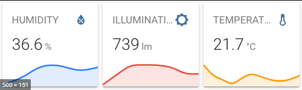

# Homekit Infused 5

## Content
- [Introduction](../index.md)
- [Installation](../installation.md)
- [Configuration](../configuration.md)
- [Addons](../addons.md)
- [Updates](../updates.md)
- [Issues & Questions](../issues.md)
- [About Me](../about.md)
- [Thanks](../thanks.md)

## Addons > Sensor

This addon allows you to quickly add core sensor cards to your views.

You can use any of the following options to modify your addon.

### Stack Config

| Name | Required | Default | Description |
|----------------------------------|-------------|----------------------|-----------------------------------------------------------------------------------------------------------------------------------------------------------------------------------|
| title | no | undefined | Set the title of the stack, ommitting this line will or setting `title: hide` will hide the title |
| columns | no | 2 | Define the number of columns this stack will use |
| square | no | false | Set if the sensors should be square or not |
| line_color | no | undefined | Set the line color of sensors with a graph for the entire stack |
| [view_layout](layout.md#view-layout) | no | undefined | This is best used in conjunction with the [layout](layout.md#view-layout) addon, but can also be used to control whether to show this stack on different screen sizes. |
| conditional | no | false | Setting this to `true` will make the stack condtional |
| conditions | no | undefined | Add entities and conditions, this will determine when this addon will be shown, e.g. if entity x is turned `on`, then show this addon (see [addons](../addons.md) for examples |
| entities | yes | list of entities | List all your entities you want to show up here |

Note: The stack config of this addon also accepts almost any of the options below, this is so that you don't have to define these configurations over and over again for each entity, see examples below!

### Sensor Extra Options
You can pass any of the options below to your entity to customize the look and feel.

By default you must enter an array of entities like in the examples above. 
You must define the entity as an object instead to make use of the options below. See examples.

| Name | Required | Default | Description |
|----------------------------------|-------------|----------------------|-----------------------------------------------------------------------------------------------------------------------------------------------------------------------------------|
| entity | yes | undefined | Set the entity used, note that this addon only supports 1 single entity per graph, if you want to be able to use more, you must create this yourself as a custom_card! |
| name | no | undefined | Set a custom name for this sensor card |
| icon | no | undefined | Set a custom icon for this sensor card |
| graph | no | line | Type of graph `none` or `line` |
| unit | no | undefined | The unit of measurement |
| detail | no | 1 | Detail of the graph 1 or 2 (1 = one point/hour, 2 = six points/hour) |
| hours_to_show | no | 24 | Hours to show in graph. Minimum is 1 hour. Big values can result in delayed rendering, especially if the selected entities have a lot of state changes |
| line_color | no | 1 | Set a line color for the graph on this sensor card |


Examples:

```yaml
# views.yaml (example)
living_room:
  addons:
    sensor:
      - title: Temperature
        columns: 2
        entities:
          - sensor.living_room_temperature
          - sensor.kitchen_temperature
```
```yaml
# views.yaml (example extra options)
living_room:
  addons:
    sensor:
      - title: Temperature
        line_color: red
        entities:
          - entity: sensor.living_room_temperature
            name: Living Room
            graph: none
          - entity: sensor.kitchen_temperature
            name: Kitchen
            line_color: green
```

### Images:



