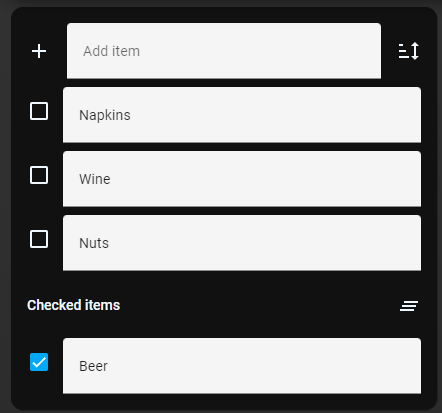

# Homekit Infused 5

## Content
- [Introduction](../index.md)
- [Installation](../installation.md)
- [Configuration](../configuration.md)
- [Addons](../addons.md)
- [Updates](../updates.md)
- [Issues & Questions](../issues.md)
- [About Me](../about.md)
- [Thanks](../thanks.md)

## Addons > Shopping List

The Shopping List card allows you to add, edit, check-off, and clear items from your shopping list.

Setup of the [Shopping List integration](https://www.home-assistant.io/integrations/shopping_list/) is required.

### Stack and Addon config

| Name | Required | Default | Description |
|----------------------------------|-------------|----------------------|-----------------------------------------------------------------------------------------------------------------------------------------------------------------------------------|
| title | yes | undefined | Set the title of the stack, ommitting this line will or setting `title: hide` will hide the title, you MUST set this for this addon! |
| [view_layout](layout.md#view-layout) | no | undefined | This is best used in conjunction with the [layout](layout.md#view-layout) addon, but can also be used to control whether to show this stack on different screen sizes. |
| conditional | no | false | Setting this to `true` will make the stack condtional |
| conditions | no | undefined | Add entities and conditions, this will determine when this addon will be shown, e.g. if entity x is turned `on`, then show this addon (see [addons](../addons.md) for examples |


```yaml
# views.yaml (example config)
  my_view:
    addons:
      shopping_list:
        - title: hide
```
### Images:


