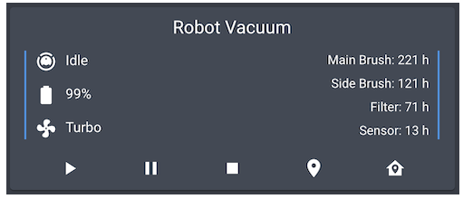
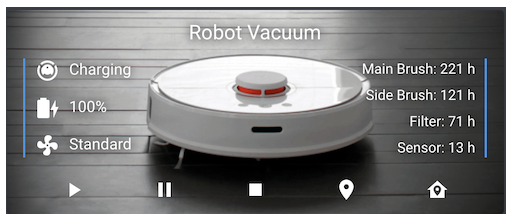

# Homekit Infused

Back to [Addon List](../addon_list.md)

# Simple Vacuum Card (Any Vacuum)



### Description
This is a small and elegant (but simple) vacuum card. This card had integrated support for most vacuums from the following brands/models: Xiaomi, Roomba, Neato, Robovac, Valetudo, Ecovacs, Deebot.

### Requirements (HACS)

| Name | Type  | Description |
|----------------------------------|-------------|---------------------------------------------------------------------------------------------------------------------------------------------------------------------------------------------------------|
| [Simple Vacuum Card](https://github.com/benct/lovelace-xiaomi-vacuum-card) | Frontend | This is a simple vacuum card, see screenshot for details |

### Resources
Add the following line to your lovelace resources 
```
/hacsfiles/lovelace-xiaomi-vacuum-card/xiaomi-vacuum-card.js
```

### Configuration
- To use this you can simply change the entity
- For more info check out the creators own documentation https://github.com/benct/lovelace-xiaomi-vacuum-card#configuration

### Advanced

| Properties | Required | Default | Description |
|----------------------------------|-------------|----------------------------------|----------------------------------------------------------------------------------------------------------------------------------------------------------------------|
| entity | yes | vacuum.xiaomi_vacuum_cleaner | Sets the vacuum entity used for this card |
| other | no | none | Since writing documentation twice would be a waste, check [here](https://github.com/benct/lovelace-xiaomi-vacuum-card#configuration) for all the options for this card | 

### Install
- Create a new file inside the folder of the view you want (e.g. /homekit-infused/user/views/vacuum/), you can name the file however you want (e.g. vacuum-card.yaml)
- Copy the code below and make changes if needed

```
- type: custom:xiaomi-vacuum-card
  style: |
    ha-card {
      border-radius: var(--border-radius);
      box-shadow: var(--box-shadow);
      opacity: 0.8;
      overflow: hidden;
  entity: vacuum.xiaomi_vacuum_cleaner
```
