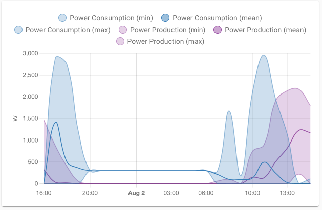
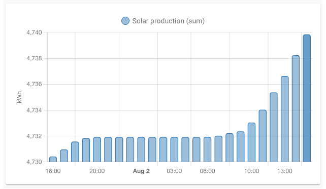

# Homekit Infused 5

## Content
- [Introduction](../index.md)
- [Installation](../installation.md)
- [Configuration](../configuration.md)
- [Addons](../addons.md)
- [Updates](../updates.md)
- [Issues & Questions](../issues.md)
- [About Me](../about.md)
- [Thanks](../thanks.md)

## Addons > Statistics Graph

This addon gives your view a core statistics graph that shows the statistics of a given entity (or multiple entities).

*NOTE: You’re configuring a statistic but your card shows no data, but no errors? That’s caused by a bug in the integration providing the entity. Integrations need to configure their entities correctly so Home Assistant knows that we need to track statistics for it and how. Open an issue with the author of the integration and link them to https://developers.home-assistant.io/docs/core/entity/sensor#long-term-statistics. 

You can use any of the following options to modify your addon.

### Stack Config

| Name | Required | Default | Description |
|----------------------------------|-------------|----------------------|-----------------------------------------------------------------------------------------------------------------------------------------------------------------------------------|
| title | no | undefined | Set the title of the stack, ommitting this line will or setting `title: hide` will hide the title |
| days_to_show | no | 30 | Set how many days you want the graph to show |
| chart_type | no | line | Set the type of chart style, you can choose between `line` and `bar` |
| stat_types | no | list of types | Set stat type(s) for this entity to show in your card, see example below. Choose between `min`, `max`, `mean`, and `sum` |
| [view_layout](layout.md#view-layout) | no | undefined | This is best used in conjunction with the [layout](layout.md#view-layout) addon, but can also be used to control whether to show this stack on different screen sizes. |
| entities | yes | list of entities | Set your entity/entities here, you can define more than one entity per card |

```yaml
# views.yaml (example)
  my_view:
    addons:
      statistics_graph:
        - title: Statistics
          days_to_show: 7
          entities:
            - sensor.unifi_gateway_mem
            - sensor.memory_use_percent
``` 
```yaml
# views.yaml (example with stat types)
  my_view:
    addons:
      statistics_graph:
        - title: Statistics
          days_to_show: 7
          entities:
            - sensor.unifi_gateway_mem
            - sensor.memory_use_percent
          stat_types:
            - min
            - max
            - mean
            - sum
```

### Images:




