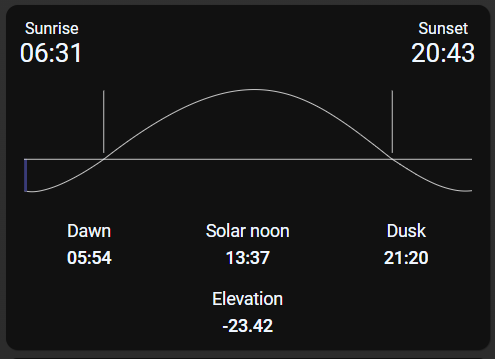

# Homekit Infused 5

## Content
- [Introduction](../index.md)
- [Installation](../installation.md)
- [Configuration](../configuration.md)
- [Addons](../addons.md)
- [Updates](../updates.md)
- [Issues & Questions](../issues.md)
- [About Me](../about.md)
- [Thanks](../thanks.md)

## Addons > Sun Card

A nice air quality card for your views.

### HACS Requirements

| Name | Type  | Description |
|----------------------------------|-------------|---------------------------------------------------------------------------------------------------------------------------------------------------------------------------------------------------------|
| [Sun Card](https://github.com/AitorDB/home-assistant-sun-card) | Frontend | A beautiful looking card that shows you the sun's position |

You can use any of the following options to modify your addon,
WARNING! YOU MUST SET AT LEAST 1 OF THE FOLLOWING VALUES FOR THIS CARD TO WORK `time_format`, `darkmode`, `language`, `show_azimuth` or `show_elevation`. 

### Stack and Addon config

| Name | Required | Default | Description |
|----------------------------------|-------------|----------------------|-----------------------------------------------------------------------------------------------------------------------------------------------------------------------------------|
| title | no | undefined | Set the title of the stack, ommitting this line will or setting `title: hide` will hide the title |
| [view_layout](layout.md#view-layout) | no | undefined | This is best used in conjunction with the [layout](layout.md#view-layout) addon, but can also be used to control whether to show this stack on different screen sizes. |
| time_format | no | 24 | Set the time format, choose between `12` or `24` |
| darkmode | no | undefined | Set this to force the card to dark or light mode |
| language | no | undefined | Changes card language, e.g. `English` |
| show_azimuth | no | false | Set to show azimuth in the footer |
| show_elevation | no | false | Set to show the elevation in the footer |
| type | no | undefined | Setting a type can make the stack condtional, this option will ONLY accept `conditional` |
| conditions | no | undefined | Add entities and conditions, this will determine when this addon will be shown, e.g. if entity x is turned `on`, then show this addon (see [addons](../addons.md) for examples |


```yaml
# views.yaml (example minimum config)
  my_view:
    addons:
      sun_card:
        - title: hide
          time_format: 24 
```
```yaml
# views.yaml (example)
  my_view:
    addons:
      sun_card:
        - title: hide
          show_azimuth: true
          show_elevation: true
          darkmode: true
```
### Images:


