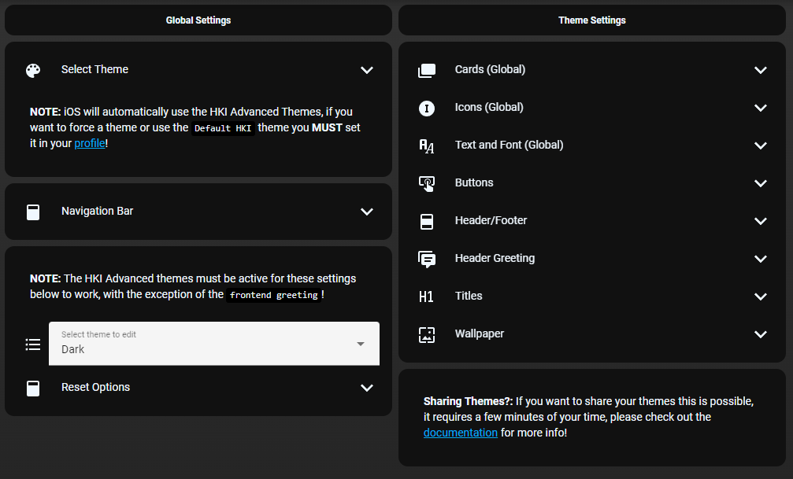

# Homekit Infused 5

## Content
- [Introduction](../index.md)
- [Installation](../installation.md)
- [Configuration](../configuration.md)
- [Addons](../addons.md)
- [Updates](../updates.md)
- [Issues & Questions](../issues.md)
- [About Me](../about.md)
- [Thanks](../thanks.md)

## Addons > Theming

HKI has 2 fully customizable themes that you can use to change the look and feel of HKI. You can find the settings in your profile menu.

**NOTE:** Only Administrators can see these options!

Open the profile menu (the button at the top right of the header), a popup will open. Now scroll through the top shortcuts bar and find `HKI Settings`.

Once there you can change the location of the navigation bar and setup the header greeting.

If you want to be a real Jedi Master in theming you must enable the `HKI Custom` themes, I recommend to set them accordingly to the time of day, that way you can have 2 different themes depending on the time of day.
Once you have enabled the Custom theme you can use all of the options in the list on this page! 95% of the settings will take effect in real-time, but some require a quick browser refresh.

### Tips & Tricks

You can use different ways of defining the colors and other settings, below some examples:

```yaml
# example with border-radius
border-radius: 12px
# or
border-radius: 12px 10px 12px 10px
```
```yaml
# example with colors
color: '#ABBABB'
# or
color: var(--paper-item-icon-color)
# or
color: LimeGreen
```

Box-shadow generator [here](https://html-css-js.com/css/generator/box-shadow/)

Border-radius generator [here](https://developer.mozilla.org/en-US/docs/Web/CSS/CSS_Backgrounds_and_Borders/Border-radius_generator)

### Sharing Themes

HKI 5 allows for sharing your themes relatively easy, but unfortunately requires a bit of your time. Experienced users can do this in a few minutes, but when you do it for the first time you might be looking at 10 minutes. 

You will find a few scripts in `/packages/homekit-infused-theme/`, e.g. `hki-light-empty.yaml`.
Copy any of the scripts (NOT the `config.yaml` file) to the same folder and rename it. Now open the file and rename the script at the top of the file, now fill in all the variables with your own variables. You can find the variables in the HKI Settings page, however you can also use the sidebar > developer tools and then put `input_text.` in the filter bar. You should see only text_inputs now. Now fill in the variables you see in the script you have just created. If you use the developer tools you will find that most of it is in the same order for faster copy/pasting.

Once done you can save it and restart Home Assistant. You can now run that script to quickly set those variables (and thus changing your theme in real-time). You can create multiple scripts and call any given script in a service to change the theme quickly every time. You can share your script with other HKI users (they will only need to put the script in the `/packages/homekit-infused-theme/` folder and restart HA). They will have to create a button to launch the script (or use the developer tools to call the service) themselves.

You can also send in your script as a PR on this repo, the best themes will be added to HKI and will be selectable through some quick toggles to quickly switch through these selected themes.

### Images:


