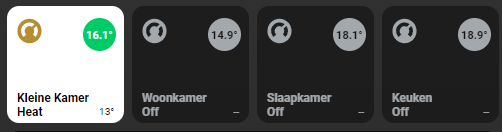
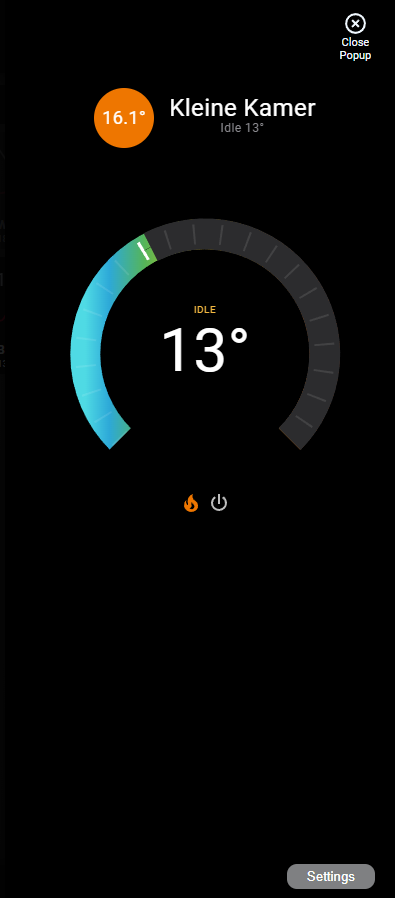

# Homekit Infused 5

## Content
- [Introduction](../index.md)
- [Installation](../installation.md)
- [Configuration](../configuration.md)
- [Addons](../addons.md)
- [Updates](../updates.md)
- [Issues & Questions](../issues.md)
- [About Me](../about.md)
- [Thanks](../thanks.md)

## Addons > Thermostat

A gorgeous thermostat for your views!

**NOTE:** This is an addon that will only display thermostats, it is useful if you want something quick or if you have a lot of thermostats. If you want to mix a thermostat inside of your button addon stack, you should use the button addon instead!

### HACS Requirements

| Name | Type  | Description |
|----------------------------------|-------------|---------------------------------------------------------------------------------------------------------------------------------------------------------------------------------------------------------|
| [Thermostat Popup Card](https://github.com/jimz011/thermostat-popup-card) | Frontend | This is a popup that opens when holding/double climate buttons, you need to add this repository MANUALLY in HACS |

You can use any of the following options to modify your addon.

| Name | Required | Default | Description |
|----------------------------------|-------------|----------------------|-----------------------------------------------------------------------------------------------------------------------------------------------------------------------------------|
| title | no | undefined | Set the title of the stack, ommitting this line will or setting `title: hide` will hide the title |
| columns | no | 3 | Sets the number of columns for this stack |
| lock | no | undefined | Puts a lock on the entire stack |
| action | no | undefined | You can reverse the default tap/hold action behaviour by setting `action: alternative` for this entire stack at once. If you want to be able to see the `more-info` window directly use `action: more-info` |
| box_shadow | no | fancy | Choose how the box-shadow of your thermostats behave, choose between `none`, `default` or `fancy`, when setting `default` it will follow the default card active box-shadow that you set in the HKI Settings |
| [view_layout](layout.md#view-layout) | no | undefined | This is best used in conjunction with the [layout](layout.md#view-layout) addon, but can also be used to control whether to show this stack on different screen sizes. |
| conditional | no | false | Setting this to `true` will make the stack condtional |
| conditions | no | undefined | Add entities and conditions, this will determine when this addon will be shown, e.g. if entity x is turned `on`, then show this addon (see [addons](../addons.md) for examples |
| entities | yes | list of entities | List your thermostat entities |

```yaml
# views.yaml (example)
  my_view:
    addons:
      thermostat:
        - title: Ground Floor Thermostats
          entities:
            - climate.thermostat_livingroom
            - climate.thermostat_kitchen
            - climate.thermostat_office
            - climate.thermostat_guest_room
        - title: First Floor Thermostats
          entities:
            - climate.thermostat_bedroom
            - climate.thermostat_bathroom
            - climate.thermostat_hallway
            - climate.thermostat_guest_bedroom
```
```yaml
# views.yaml (example with stack options)
  my_view:
    addons:
      thermostat:
        - title: Thermostats
          columns: 2
          lock: true
          box_shadow: fancy
          entities:
            - climate.thermostat_livingroom
            - climate.thermostat_kitchen
            - climate.thermostat_office
            - climate.thermostat_guest_room
```

#### Thermostat Extra Options
If you define your entity as an object you can unlock more options.

| Name | Required | Default | Description |
|----------------------------------|-------------|----------------------|-----------------------------------------------------------------------------------------------------------------------------------------------------------------------------------|
| entity | yes | undefined | Sets the entity used |
| name | no | default | Set a custom name for this entity, this accepts [JS templates](https://github.com/custom-cards/button-card#javascript-templates) |
| icon | no | mdi:thermostat | Set a custom icon for this button, this accepts [JS templates](https://github.com/custom-cards/button-card#javascript-templates) |
| lock | no | false | Puts a lock on the button, choose between `true` or `false` |
| action | no | undefined | You can reverse the default tap/hold action behaviour by setting `action: alternative` |
| ambient_temperature | no | undefined | Set this to show the current temperature from a different sensor in your thermostat buttons, this is only an aesthetic change and doesn't change the functionality of your thermostat! |
| attribute | no | undefined | This only accepts `state`, only use this if your thermostats show `undefined` as its state |
| box_shadow | no | fancy | Choose how the box-shadow of your thermostats behave, choose between `none`, `default` or `fancy`, when setting `default` it will follow the default card active box-shadow that you set in the HKI Settings |

```yaml
# views.yaml (example with extra options)
  my_view:
    addons:
      thermostat:
        - title: Thermostats
          entities:
            - entity: climate.thermostat_livingroom
              lock: true
            - entity: climate.thermostat_kitchen
              ambient_temperature: sensor.kitchen_temperature
              box_shadow: none
              attribute: state
```

### Images:




