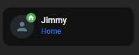

# Homekit Infused 5

## Content
- [Introduction](../index.md)
- [Installation](../installation.md)
- [Configuration](../configuration.md)
- [Addons](../addons.md)
- [Updates](../updates.md)
- [Issues & Questions](../issues.md)
- [About Me](../about.md)
- [Thanks](../thanks.md)

## Addons > Tile

The tile card gives you a quick overview of your entity. The card allows you to toggle the entity and show the more info dialog. A badge is shown for some entities like the climate or person entities.

You can use any of the following options to modify your addon.

### Stack Config

| Name | Required | Default | Description |
|----------------------------------|-------------|----------------------|-----------------------------------------------------------------------------------------------------------------------------------------------------------------------------------|
| title | no | undefined | Set the title of the stack, ommitting this line will or setting `title: hide` will hide the title |
| columns | no | 3 | Define the number of columns this stack will use |
| [view_layout](layout.md#view-layout) | no | undefined | This is best used in conjunction with the [layout](layout.md#view-layout) addon, but can also be used to control whether to show this stack on different screen sizes. |
| conditional | no | false | Setting this to `true` will make the stack condtional |
| conditions | no | undefined | Add entities and conditions, this will determine when this addon will be shown, e.g. if entity x is turned `on`, then show this addon (see [addons](../addons.md) for examples |
| entities | yes | list of tiles | List all your tiles you want to show up here |

### Tile Extra Options

| Name | Required | Default | Description |
|----------------------------------|-------------|----------------------|-----------------------------------------------------------------------------------------------------------------------------------------------------------------------------------|
| entity | yes | undefined | Set the entity your tile should use |
| name | no | default entity name | Set a custom name for your entity |
| icon | no | default entity icon | Set a custom icon for your entity |
| color | no | undefined | Set the color when the entity is active. By default, the color is based on `state`, `domain`, and `device_class` of your entity. It accept [color token](https://www.home-assistant.io/dashboards/tile/#available-color-tokens) or hex color code. |
| show_entity_picture | no | false | If your entity has a picture, it will replace the icon. |
| tap_action | no | undefined | Action taken on card tap. See [action documentation](https://www.home-assistant.io/dashboards/actions/#tap-action). By default, it will show the `more-info` dialog. |
| icon_tap_action | no | undefined | Action taken on icon card tap. See [action documentation](https://www.home-assistant.io/dashboards/actions/#tap-action). By default, it will `toggle` the entity (if possible), otherwise, show the `more-info` dialog.

```yaml
# views.yaml (example minimum)
  my_view:
    addons:
      tile:
        - title: My Tiles
          cards:
            - light.living_room
            - person.jimmy
            - person.stephanie
```
```yaml
# views.yaml (example extra options)
  my_view:
    addons:
      tile:
        - title: My Tiles
          cards:
            - entity: light.living_room
              name: Living
            - entity: person.jimmy
              show_entity_picture: false
            - entity: person.stephanie
              tap_action:
                action: navigate
                navigation_path: stephanie
              
```

### Images:


