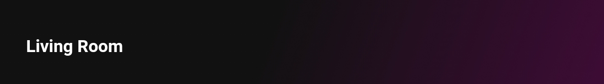
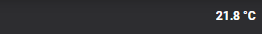

# Homekit Infused

Back to [Addon List](../addon_list.md)

# Title Text Card



### Description
This card is used to create a header style name for the views (see screenshot)

### Configuration
- You can only change the name section of this card!

### Advanced

| Properties | Required | Default | Description |
|----------------------------------|-------------|----------------------------------|----------------------------------------------------------------------------------------------------------------------------------------------------------------------|
| name | yes | none | Sets the name/title to show (accepts JS templates!)|
| justify_self | no | start | Justify the content choose between `start`, `center` or `end` |
| background_color | no | 'rgba(0,0,0,0.0)' | Sets the background color of the card, by default this is transparant |
| box_shadow | no | none | Sets a box-shadow (only useful when background is not transparant) |
| border_radius | no | none | Sets a border-radius (only useful when background is not transparant) |
| font_size | no | var(--title-text-font-size) | Sets an individual font_size for this card, if you seek to set title text styles globally please refer to the themes section of the documentation |
| font_weight | no | var(--title-text-font-weight) | Sets an individual font_weight for this card, if you seek to set title text styles globally please refer to the themes section of the documentation |
| font_color | no | var(--title-text-color) | Sets an individual text color for this card, if you seek to set title text styles globally please refer to the themes section of the documentation |

### Install
- Create a new file inside the folder of the view you want (e.g. /homekit-infused/user/views/location/), you can name the file however you want (e.g. title-text-card.yaml)
- Copy the code below and make changes if needed

```
- !include
  - '../../../base/templates/other/title-text.yaml'
  - name: Living Room
```

### Extra Information
This card is probably best used when placed inside a vertical-stack (this will avoid creating a separate file for just a title on each view)
```
- type: vertical-stack
  cards:
    - !include
      - '../../../base/templates/other/title-text.yaml'
      - name: Living Room
    - type: horizontal-stack
      cards:
        - type: entity-button
          entity: light.livingroom_lamp_1
        - type: entity-button
          entity: light.livingroom_lamp_2
        - type: entity-button
          entity: light.livingroom_lamp_3
```

```
# example with 2 title-text-cards in a horizontal stack (see image above)
- type: vertical-stack
  cards:
    - type: horizontal-stack
      cards:
        - !include
          - '../../../base/templates/other/title-text.yaml'
          - name: Bedroom
        - !include
          - '../../../base/templates/other/title-text.yaml'
          - name: "[[[ return `${states['sensor.bedroom_temperature'].state} °C`; ]]]"
            justify_self: end
    - type: horizontal-stack
      cards:
        - type: entity-button
          entity: light.livingroom_lamp_1
        - type: entity-button
          entity: light.livingroom_lamp_2
        - type: entity-button
          entity: light.livingroom_lamp_3
```
Vertical stacks will render from top to bottom, horizontal-stacks from left to right. In this example the vertical-stack is the 'parent'. It will render the title-text-card as it's first card, the second card is a horizontal-stack (which has 3 buttons in it). Since the buttons are placed inside the horizontal-stack the buttons will be stacked next to each other horizontally.

### Layout card and horizontal/vertical stacks
I know the HA documentation has this perfectly explained already, but to make it easier on you I will try to explain in more detail [here](../addons/stacks.md)
