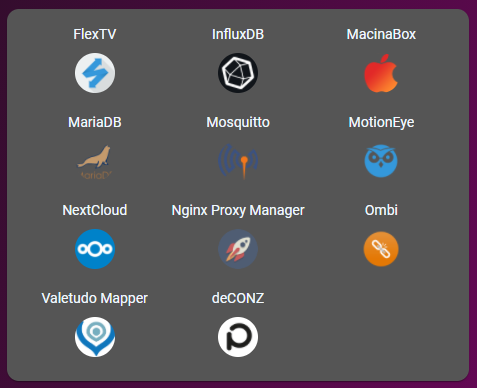
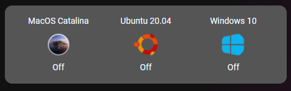

# Homekit Infused

Back to [Addon List](../addon_list.md)

# Unraid Docker Container/VM Card



### Description
This is a card that can show you the vms/docker containers that are currently running or turned off.

### Requirements (HACS)
- For this to work you must have a working MQTT broker setup
- For this to work you must download the Unraid-API container in the Unraid Community Applications store. You will then have to open the containers webUI and setup MQTT after installing the container.

### Configuration
- To use this properly you will have to add a picture_entity to each of your containers, you must do this in `customize.yaml`. 
- There are quite a few docker container images already present in the `/www/images/docker-containers/` folder, you can add more images there if you like.
- No additional configuration required
- Experienced users may find that this is simply making use of an auto-entities card, which is very powerful and has way more [options](https://github.com/thomasloven/lovelace-auto-entities) than described here!

```
# example customize.yaml
switch.jimmy_docker_adguard_home:
  friendly_name: AdGuard
  entity_picture: /local/images/docker-container-images/adguard.png
switch.jimmy_docker_appdaemon:
  friendly_name: AppDaemon4
  entity_picture: /local/images/docker-container-images/appdaemon.png
switch.jimmy_docker_bitwardenrs:
  friendly_name: BitwardenRS
  entity_picture: /local/images/docker-container-images/bitwarden.png
```

### Install
- Create a new file inside the folder of the view you want (e.g. /homekit-infused/user/views/system/), you can name the file however you want (e.g. unraid-docker.yaml)
- Copy the code below and make changes if needed

```
# example code to show docker containers that are running
- type: custom:auto-entities
  filter:
    include:
      - entity_id: '*docker*'
        state: "on"
  show_empty: false
  sort:
    method: name
    numeric: true
  card:
    type: glance
    style: |
      ha-card {
        border-radius: var(--border-radius);
        box-shadow: var(--box-shadow);
      }
    show_state: false
    columns: 3
```
``` 
# example code to show docker containers that are not running
- type: custom:auto-entities
  filter:
    include:
      - entity_id: '*docker*'
        state: "off"
  show_empty: false
  sort:
    method: name
    numeric: true
  card:
    type: glance
    style: |
      ha-card {
        border-radius: var(--border-radius);
        box-shadow: var(--box-shadow);
      }
    show_state: false
    columns: 3
```
```
# example code of fetching vm's and always showing the state
- type: custom:auto-entities
  filter:
    exclude:
      - entity_id: '*usb*'
    include:
      - entity_id: 'switch.jimmy_vm*' ### Replace jimmy with your own server name, check the dev_tools if you aren't sure!
  show_empty: false
  sort:
    method: name
    numeric: true
  card:
    type: glance
    style: |
      ha-card {
        border-radius: var(--border-radius);
        box-shadow: var(--box-shadow);
      }
    columns: 3
```

### Layout card and horizontal/vertical stacks
I know the HA documentation has this perfectly explained already, but to make it easier on you I will try to explain in more detail [here](../addons/stacks.md)
