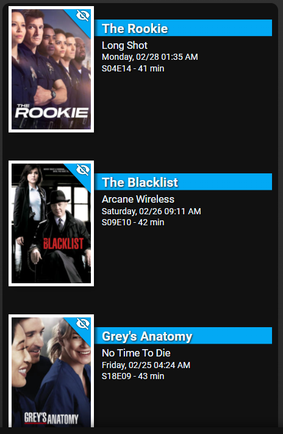

# Homekit Infused 5
## Content
- [Introduction](../index.md)
- [Installation](../installation.md)
- [Configuration](../configuration.md)
- [Addons](../addons.md)
- [Updates](../updates.md)
- [Issues & Questions](../issues.md)
- [About Me](../about.md)
- [Thanks](../thanks.md)

## Addons > Upcoming Media

This addon gives your view an overview of upcoming movies/tv shows and recently added for your Plex/Sonarr/Radarr server.

### HACS Requirements

| Name | Type  | Description |
|----------------------------------|-------------|---------------------------------------------------------------------------------------------------------------------------------------------------------------------------------------------------------|
| [Radarr Upcoming Media](https://github.com/custom-components/sensor.radarr_upcoming_media) | Integration | This integration fetches data from your Radarr webserver |
| [Sonarr Upcoming Media](https://github.com/custom-components/sensor.sonarr_upcoming_media) | Integration | This integration fetches data from your Sonarr webserver |
| [Plex Recently Added](https://github.com/custom-components/sensor.sonarr_upcoming_media) | Integration | This integration fetches data from your Plex server to show what has recently been added |
| [Upcoming Media Card](https://github.com/custom-cards/upcoming-media-card) | Frontend | This is the card used to show the above integrations in a nice way |

You can use any of the following options to modify your addon.

| Name | Required | Default | Description |
|----------------------------------|-------------|----------------------|-----------------------------------------------------------------------------------------------------------------------------------------------------------------------------------|
| title | no | undefined | Set the title of the stack, ommitting this line will or setting `title: hide` will hide the title |
| entity | yes | undefined | Add the entity that should be used for this stack, you can only define one entity per card! |
| [view_layout](layout.md#view-layout) | no | undefined | This is best used in conjunction with the [layout](layout.md#view-layout) addon, but can also be used to control whether to show this stack on different screen sizes. |

```yaml
# views.yaml (example)
  my_view:
    addons:
      upcoming_media:
        - title: Recently Added TV
          entity: sensor.recently_added_tv
        - title: Recently Added Movies
          entity: sensor.recently_added_movies
        - title: Upcoming TV
          entity: sensor.sonarr_upcoming_media
        - title: Upcoming Movies
          entity: sensor.radarr_upcoming_media
```

### Images:


