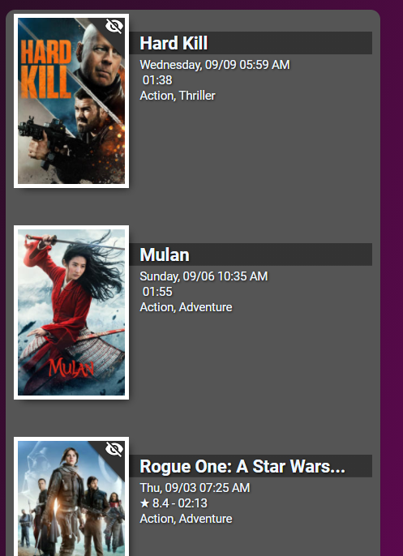

# Homekit Infused

Back to [Addon List](../addon_list.md)

# Upcoming and Recently Added Media Card


### Description
This is a nice card to show your upcoming and recently added media from your Plex/Sonarr/Radarr libraries.

### Requirements (HACS)

| Name | Type  | Description |
|----------------------------------|-------------|---------------------------------------------------------------------------------------------------------------------------------------------------------------------------------------------------------|
| [Upcoming Media Card](https://github.com/custom-cards/upcoming-media-card) | Frontend | This is a beautiful card from the creator of Custom Header to show your movies/series |
| [Plex Recently Added](https://github.com/custom-components/sensor.plex_recently_added) | Integration | If you have a plex library you can install this, you can use the sensor to show all the media that has been recently added to your plex library (this is useful with the components described below) |
| [Sonarr Upcoming Media](https://github.com/custom-components/sensor.sonarr_upcoming_media) | Integration | If you use sonarr you can install this to see what series will be added soon |
| [Radarr Upcoming Media](https://github.com/custom-components/sensor.radarr_upcoming_media) | Integration | If you use sonarr you can install this to see what movies will be added soon |

### Resources
Add the following line to your lovelace resources 
```
/hacsfiles/upcoming-media-card/upcoming-media-card.js
```

### Configuration
- To use this you can simply change the entity of the example card below
- You can only have 1 entity per card, if you want to show both the recently added series and movies you will need to create two of these cards!
- Experienced users can play with the styles if they want

### Advanced

| Properties | Required | Default | Description |
|----------------------------------|-------------|----------------------------------|----------------------------------------------------------------------------------------------------------------------------------------------------------------------|
| entity | yes | sensor.recently_added_tv | Sets the entity from where to fetch the movie details |

### Install
- Create a new file inside the folder of the view you want (e.g. /homekit-infused/user/views/media/), you can name the file however you want (e.g. upcoming-card.yaml)
- Copy the code below and make changes if needed

```
- type: 'custom:upcoming-media-card'
  style: |
    ha-card {
      border-radius: var(--border-radius);
      box-shadow: var(--box-shadow);
    }
  entity: sensor.recently_added_tv 
```

### Layout card and horizontal/vertical stacks
I know the HA documentation has this perfectly explained already, but to make it easier on you I will try to explain in more detail [here](../addons/stacks.md)
