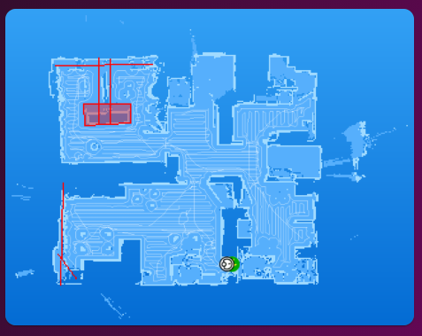

# Homekit Infused

Back to [Addon List](../addon_list.md)

# Vacuum Live Map (Valetudo or Valetudo RE only)


### Description
This is a simple live map for a (xiaomi) vacuum cleaner, a rooted vacuum with Valetudo (RE) is required!

### Configuration
- You will have to have to root your vacuum with either Valetudo or Valetudo RE and also run the separate mapper container to show store the map values.
- I will not explain how to root your vacuum as there are plenty tutorials out there on the internet. You can however check quickly if your vacuum is supported by visiting [Dustbuilder](https://builder.dontvacuum.me/), click on the vacuum image to see if it is supported!
- There is a short explanation on how to root your vacuum available on our discord server (check out the #jimz011-and-dwains-tips channel).
- I personally use [Valetudo RE](https://github.com/rand256/valetudo) as I think it is better than [Valetudo](https://github.com/Hypfer/Valetudo). But this is entirely up to you. If you use Valetudo RE you can activate MQTT through the settings in the webui of the vacuum cleaner, which will save you a lot of trouble.
- This addon will work for ANY vacuum that can send out a camera entity. If your vacuum happens to not be rooted with Valetudo (RE) but does have a camera entity, then this will likely work for you as well!

### Advanced

| Properties | Required | Default | Description |
|----------------------------------|-------------|----------------------------------|----------------------------------------------------------------------------------------------------------------------------------------------------------------------|
| entity | yes | camera.rockrobo_map | Sets the camera entity of your map |
| show_name | no | false | Show the entity name |

### Install
- Create a new file inside the folder of the view you want (e.g. /homekit-infused/user/views/vacuum/), you can name the file however you want (e.g. vacuum-live-map.yaml)
- Copy the code below and make changes if needed

```
- type: picture-entity
  style: |
    ha-card {
      border-radius: var(--border-radius);
      box-shadow: var(--box-shadow);
    }
  entity: camera.rockrobo_map
  show_name: false
  show_state: false
  tap_action:
    action: none
  hold_action:
    action: none
  camera_view: live
```

### Layout card and horizontal/vertical stacks
I know the HA documentation has this perfectly explained already, but to make it easier on you I will try to explain in more detail [here](../addons/stacks.md)
