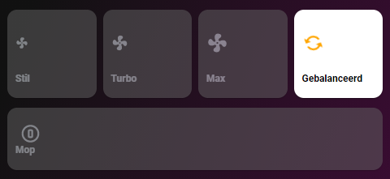

# Homekit Infused

Back to [Addon List](../addon_list.md)

# Vacuum Speed Controls (Any Vacuum)
*HKI Framework 3.0.5 or higher required



### Description
This is a complete set of vacuum speed controls.

### Configuration
- To use this you must have a vacuum entity setup (e.g. Xiaomi Roborock)
- If you use a Xiaomi Roborock and have Valetudo, I will suggest connecting your vacuum with the default miio integration in HA as well (they will both function at the same time)
- For this card to work you MUST add a sensor and 2 automations to your setup!
```
# example configuration.yaml
vacuum:
  - platform: xiaomi_miio
    host: 192.168.0.xx
    token: !secret roborock_token
```
```
# example sensors
sensor:
  - platform: template 
    sensors:
      xiaomi_vacuum_fan_speed_state:
        value_template: >-
          {{ states.vacuum.xiaomi_vacuum_cleaner.attributes.fan_speed }}
          
# change xiaomi_vacuum_cleaner with your own entity!
# check if your vacuum entity has the fan_speed attribute, if it is named differently, then change that as well!
```
The automation below may or may not work correctly out of the box, your vacuum might have different names for the speed settings on your xiaomi. The settings used here should be default for a Roborock S50/S55.
If it doesn't work out of the box, note that you will have to change the entity_id first and then you might need to change the set_fan_speed property. Do NOT change the input_select.xiaomi_vacuum names or options, even if it doesn't correspond with your own fan settings!
More examples of this in the extra information section


```
# example automations
automation:
  # Xiaomi Fan Speed
  - alias: xiaomi vacuum set fan speed
    initial_state: 'true'
    trigger:
    - platform: state
      entity_id: input_select.xiaomi_vacuum
    action:
      service: vacuum.set_fan_speed
      data_template:
        entity_id: vacuum.xiaomi_vacuum_cleaner
        fan_speed: >
          
            Silent
          
            Standard
          
            Medium
          
            Turbo
          
            Gentle
          
  
  # Xiaomi Fan Speed Input Select
  - alias: xiaomi vacuum set fan speed
    initial_state: 'true'
    trigger:
    - platform: state
      entity_id: sensor.xiaomi_vacuum_fan_speed_state
    action:
      service: input_select.select_option
      data_template:
        entity_id: input_select.xiaomi_vacuum
        option: >
          
            Silent
          
            Standard
          
            Medium
          
            Turbo
          
            Gentle
          
        
# change xiaomi_vacuum_cleaner with your own entity!
```


### Advanced

| Properties | Required | Default | Description |
|----------------------------------|-------------|----------------------------------|----------------------------------------------------------------------------------------------------------------------------------------------------------------------|
| name_silent | yes | Silent | Change the name of this button |
| name_turbo | no | Turbo | Change the name of this button |
| name_max | no | Max | Change the name of this button |
| name_balanced | Balanced | Find Me | Change the name of this button |
| name_mop | no | Mop | Change the name of this button |
| grid | no | default-hki-grid | Change the grid of the button, choose from `default-hki-grid`, `light-devices-grid`, `old-hki-grid` or `old-light-devices-grid` |

### Install
- Create a new file inside the folder of the view you want (e.g. /homekit-infused/user/views/vacuum/), you can name the file however you want (e.g. vacuum-speed-controls.yaml)
- Copy the code below and make changes if needed

```
- !include
  - '../../../base/templates/vacuum/modes.yaml'
  - name_silent: Silent
    name_turbo: Turbo
    name_max: Max
    name_balanced: Balanced
    name_mop: Mop
```

### Extra Information
Here is an example of what you'll need to change when this card doesn't work out of the box. 
You will have to figure out the correct names for your fan speed.
If you use the miHome app, you can simply set any fan speed and then check the sensor we've just created in your developer-tools. It should show you the correct fan speed state/name if you've setup the sensor correctly.
You can use these names to fix the automation like in the example below. Please compare this to the example above, do NOT change anything that is the same in both examples!


```
# example automations
automation:
  # Xiaomi Fan Speed
  - alias: xiaomi vacuum set fan speed
    initial_state: 'true'
    trigger:
    - platform: state
      entity_id: input_select.xiaomi_vacuum
    action:
      service: vacuum.set_fan_speed
      data_template:
        entity_id: vacuum.rockrobo
        fan_speed: >
          
            101
          
            102
          
            103
          
            104
          
            105
          
  
  # Xiaomi Fan Speed Input Select
  - alias: xiaomi vacuum set fan speed
    initial_state: 'true'
    trigger:
    - platform: state
      entity_id: sensor.xiaomi_vacuum_fan_speed_state
    action:
      service: input_select.select_option
      data_template:
        entity_id: input_select.xiaomi_vacuum
        option: >
          
            Silent
          
            Standard
          
            Medium
          
            Turbo
          
            Gentle
          
```

