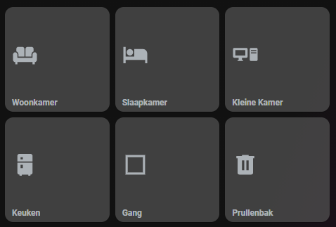

# Homekit Infused

Back to [Addon List](../addon_list.md)

# Valetudo Preset Button (Valetudo and Valetudo RE only)
*HKI Framework 3.0.5 or higher required



### Description
This is a button that can call a service to either clean a zone or go to a spot.

### Configuration
- To use this you must have a vacuum entity setup (e.g. Xiaomi Roborock)
- For this to work you must setup zones and/or spots in Valetudo (RE), you can use the same names below
- For this to work you must have a working MQTT Broker
- You must setup MQTT in Valetudo so that Home Assistant can control it over MQTT (newer versions of this can do this in the UI, though I am not sure about regular Valetudo. refer to their documentation on how to enable mqtt)

### Advanced

| Properties | Required | Default | Description |
|----------------------------------|-------------|----------------------------------|----------------------------------------------------------------------------------------------------------------------------------------------------------------------|
| template | yes | '../../../base/templates/vacuum/zoned-preset-button.yaml' | Sets the template to either clean a zone or go to a spot, choices are `zoned-preset-button.yaml` or `go-to-spot-preset-button.yaml` |
| entity | yes | vacuum.rockrobo | The entity MUST be  |
| name | no | none | Name of the room/spot |
| icon | no | none | Icon for the button |
| zone_id | yes/no | ['Living Room'] | Enter the zone_id here, this must be the same name as the zone you've set in the Valetudo webinterface! Don't forget the brackets! e.g. `['Zone']` (only available when selected the zoned-preset-button) |
| spot_id | yes/no | 'Trash Can' | Enter the spot_id here, this must be the same name as the go_to spot you've set in the Valetudo webinterface! Notice that there are NO brackets! e.g. `'Spot'` (only available when selected the go-to-spot-preset-button) |
| grid | no | default-hki-grid | Change the grid of the button, choose from `default-hki-grid`, `light-devices-grid`, `old-hki-grid` or `old-light-devices-grid` |

### Install
- Create a new file inside the folder of the view you want (e.g. /homekit-infused/user/views/vacuum/), you can name the file however you want (e.g. vacuum-valetudo-presets.yaml)
- Copy the code below and make changes if needed

```
# example zoned cleaning preset button
- !include
  - '../../../base/templates/vacuum/zoned-preset-button.yaml'
  - name: Livingroom
    icon: mdi:sofa
    entity: vacuum.rockrobo
    zone_id: ['Living Room']
```
```
# example go to spot preset button
- !include
  - '../../../base/templates/vacuum/go-to-spot-preset-button.yaml'
  - name: Go to Trash
    icon: mdi:trash-can
    entity: vacuum.rockrobo
    spot_id: 'Trash Can'
```
```
# example of a row with 2 zoned cleaning and a go to spot preset button
- type: horizontal-stack
  cards:
    - !include
      - '../../../base/templates/vacuum/zoned-preset-button.yaml'
      - name: Woonkamer
        icon: mdi:sofa
        entity: vacuum.rockrobo
        zone_id: ['Woonkamer']
    - !include
      - '../../../base/templates/vacuum/zoned-preset-button.yaml'
      - name: Slaapkamer
        icon: mdi:bed
        entity: vacuum.rockrobo
        zone_id: ['Slaapkamer']
    - !include
      - '../../../base/templates/vacuum/go-to-spot-preset-button.yaml'
      - name: Go to Trash
        icon: mdi:trash-can
        entity: vacuum.rockrobo
        spot_id: 'Trash Can'
```

### Layout card and horizontal/vertical stacks
I know the HA documentation has this perfectly explained already, but to make it easier on you I will try to explain in more detail [here](../addons/stacks.md)
