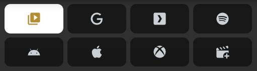
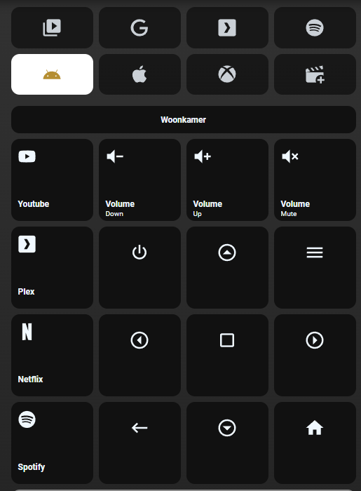

# Homekit Infused 5

## Content
- [Introduction](../index.md)
- [Installation](../installation.md)
- [Configuration](../configuration.md)
- [Addons](../addons.md)
- [Updates](../updates.md)
- [Issues & Questions](../issues.md)
- [About Me](../about.md)
- [Thanks](../thanks.md)

## Addons > View Selector

This addon gives your view a selector menu at the top of your view.

**WARNING:** The view_selector is ported from HKI 4, this addon will undergo some major changes soon, the config variables may or may not change in the future.

The view selector works by leveraging multiple views as pages. You must add the view_selector to every view that you want the view_selector to show on.

**Note:** When adding view_selector to your view, that view will be removed from the main menu! You can re-add views to your menu by adding `show_in_menu: true`. It is advised to only use one of the views that belong to a view_selector group in the main menu (but this is completely up to you).

**Tip:** It is suggested that you set a title with the same name for each view (since by default the view title is the object name unless you specify one manually). See example below.

| Name | Required | Default | Description |
|----------------------------------|-------------|----------------------|-----------------------------------------------------------------------------------------------------------------------------------------------------------------------------------|
| columns | no | 4 | Set the amount of columns the view_selector uses on this page |
| aspect_ratio | no | 1/1 | Set a custom aspect_ratio, this is useful when using less buttons |
| elements | yes | a list of elements | Set the elements your view selector should use, see options below |

#### Elements Extra Options

| Name | Required | Default | Description |
|----------------------------------|-------------|----------------------|-----------------------------------------------------------------------------------------------------------------------------------------------------------------------------------|
| name | no | undefined | Sets the name of this button, this accepts [JS templates](https://github.com/custom-cards/button-card#javascript-templates) | |
| icon | no | undefined | Sets the icon of this button, this accepts [JS templates](https://github.com/custom-cards/button-card#javascript-templates) | |
| path | yes | undefined | Sets the path this button should take you to |
| this_view | no | undefined | You can add this to your selector to make HKI aware that you are currently on this page, this will give the button a nice `ON` appearance. The view selector works fine without it though |
| button_badge | no | undefined | You can set a button badge just like in the menu. A useful case would be for example a lights view with multiple floors where the badge shows you the number of lights `on` on that specific floor |

```yaml
# views.yaml (example with 2 views with a view_selector)
  stephanie_location:
    title: Stephanie
    view_selector:
      columns: 3
      aspect_ratio: 3/1
      elements:
        - name: Agenda
          icon: mdi:calendar-edit
          path: stephanie_calendar
          this_view: true
        - name: Location
          icon: mdi:map-marker
          path: stephanie_location

  stephanie_calendar:
    title: Stephanie
    view_selector:
      columns: 3
      aspect_ratio: 3/1
      elements:
        - name: Agenda
          icon: mdi:calendar-edit
          path: stephanie_calendar
        - name: Location
          icon: mdi:map-marker
          path: stephanie_location
          this_view: true
```
```yaml
# views.yaml (example with 2 views with a view_selector with one view shown in the main menu)
  stephanie_location:
    title: Stephanie
    show_in_menu: true
    view_selector:
      columns: 3
      aspect_ratio: 3/1
      elements:
        - name: Agenda
          icon: mdi:calendar-edit
          path: stephanie_calendar
          this_view: true
        - name: Location
          icon: mdi:map-marker
          path: stephanie_location

  stephanie_calendar:
    title: Stephanie
    view_selector:
      columns: 3
      aspect_ratio: 3/1
      elements:
        - name: Agenda
          icon: mdi:calendar-edit
          path: stephanie_calendar
        - name: Location
          icon: mdi:map-marker
          path: stephanie_location
          this_view: true
```

### Images:



