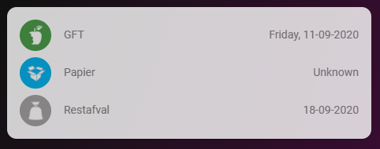

# Homekit Infused

Back to [Addon List](../addon_list.md)

# Waste Collection Card


### Description
This is a very simple and basic card to track your waste collection. 

### Configuration
To use this you will need to setup a custom component for your situation that monitors your waste collection (for dutch users this is usually mijn_afvalwijzer or afvalbeheer, but this could be anything that suits your needs)

To get the custom icons that are shown in the card you will need to add an entity_picture to the entities in your `customize.yaml`. To view an example of these images you can open the `www/images/` folder. These images are free to use in your own setup. Example of customize.yaml below:
```
sensor.mijnafvalwijzer_gft:
  friendly_name: GFT
  entity_picture: /local/images/afvalbeheer/afval_gft_small.png
sensor.mijnafvalwijzer_pmd:
  friendly_name: PMD
  entity_picture: /local/images/afvalbeheer/afval_pmd_small.png
sensor.mijnafvalwijzer_papier:
  friendly_name: Papier
  entity_picture: /local/images/afvalbeheer/afval_papier_small.png
sensor.mijnafvalwijzer_restafval:
  friendly_name: Restafval
  entity_picture: /local/images/afvalbeheer/afval_rest_small.png
```

### Advanced

| Properties | Required | Default | Description |
|----------------------------------|-------------|----------------------------------|----------------------------------------------------------------------------------------------------------------------------------------------------------------------|
| type | yes | entities | Choose between `entities` or `glance` |
| entities | yes | none | Sets the entity/entities you want to show on the card |
| columns | no | 3 | You can add the number of columns when the type is set to `glance`, this has no effect when the type is set to `entities` |

### Install
- Create a new file inside the folder of the view you want (e.g. /homekit-infused/user/views/waste/), you can name the file however you want (e.g. waste-collection-card.yaml)
- Copy the code below and make changes if needed

```
- type: entities
  style: |
    ha-card {
      box-shadow: var(--box-shadow);
      border-radius: var(--border-radius);
      font-family: var(--font-family);
      font-size: var(--name-font-size);
      opacity: 0.8;
    }
  entities:
    - sensor.mijnafvalwijzer_gft
    - sensor.mijnafvalwijzer_papier
    - sensor.mijnafvalwijzer_restafval
```

### Layout card and horizontal/vertical stacks
I know the HA documentation has this perfectly explained already, but to make it easier on you I will try to explain in more detail [here](../addons/stacks.md)
