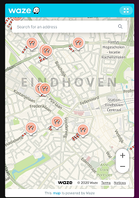

# Homekit Infused

Back to [Addon List](../addon_list.md)

# Waze Card


### Description
This card will show you live traffic information on your current location (might not work nicely when on WiFi, this will depend on your ISP)

### Configuration
- No additional configuration required!

### Install
- Create a new file inside the folder of the view you want (e.g. /homekit-infused/user/views/traffic/), you can name the file however you want (e.g. waze-card.yaml)
- Copy the code below and make changes if needed

```
- type: iframe
  url: https://embed.waze.com/iframe
  aspect_ratio: 150%
```
