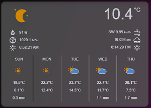

# Homekit Infused

Back to [Addon List](../addon_list.md)

# Weather Card


### Description
This is a normal (animated) weather card.

### Requirements (HACS)

| Name | Type  | Description |
|----------------------------------|-------------|---------------------------------------------------------------------------------------------------------------------------------------------------------------------------------------------------------|
| [Weather Card](https://github.com/bramkragten/weather-card) | Frontend | This is a customizable animated weather card, see screenshot for details |

### Resources
Add the following line to your lovelace resources 
```
/hacsfiles/weather-card/weather-card.js
```

### Configuration
To use this you must have dark sky setup, If you do NOT have a dark sky API key then you are out of luck since dark sky no longer hands out API keys. Existing users of darksky can use their API keys until 2021 until they cease to work. The card might work with other weather entities, however this has NOT been tested!

Below an example of your configuration.yaml:
```
# Example configuration.yaml entry
weather:
  - platform: darksky
    api_key: YOUR_API_KEY
    mode: daily
```
If you want to show the sunrise and sunset times, make sure the sun component. This integration is by default enabled, unless you’ve disabled or removed the default_config: line from your configuration. If that is the case, the following example shows you how to enable this integration manually:
```
# Example configuration.yaml entry
sun:
```

### Advanced

| Properties | Required | Default | Description |
|----------------------------------|-------------|----------------------------------|----------------------------------------------------------------------------------------------------------------------------------------------------------------------|
| entity | yes | weather.dark_sky | Sets the weather entity used for this card |
| name | no | none | Sets a custom city name (by default the name is unused) |
| current | no | true | Show the current weather icon, the current temperature and title |
| forecast | no | true | Shows forecast |
| hourly_forecast | no | False | Shows hourly forecast |
| number_of_forecasts | no | 5 | Shows number of forecasts |


### Install
- Create a new file inside the folder of the view you want (e.g. /homekit-infused/user/views/frontpage/), you can name the file however you want (e.g. weather-card.yaml)
- Copy the code below and make changes if needed

```
- type: custom:weather-card
  style: |
    ha-card {
      font-size: var(--name-font-size);
      font-family: var(--font-family);
      border-radius: var(--border-radius);
      box-shadow: var(--box-shadow);
      opacity: 0.8;
    }
  entity: weather.dark_sky
  name: Eindhoven
  current: true
  details: true
  forecast: true
  hourly_forecast: false
  number_of_forecasts: 5
```

### Layout card and horizontal/vertical stacks
I know the HA documentation has this perfectly explained already, but to make it easier on you I will try to explain in more detail [here](../addons/stacks.md)
