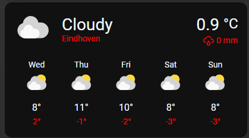
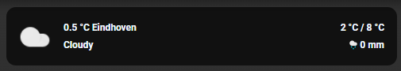

# Homekit Infused 5

## Content
- [Introduction](../index.md)
- [Installation](../installation.md)
- [Configuration](../configuration.md)
- [Addons](../addons.md)
- [Updates](../updates.md)
- [Issues & Questions](../issues.md)
- [About Me](../about.md)
- [Thanks](../thanks.md)

## Addons > Weather

This addon gives your view a simple but elegant weather forecast card.

### HACS Requirements

| Name | Type  | Description |
|----------------------------------|-------------|---------------------------------------------------------------------------------------------------------------------------------------------------------------------------------------------------------|
| [Simple Weather Card](https://github.com/kalkih/simple-weather-card) | Frontend | A simple weather card (only required if `type: simple_weather`) |

You can use any of the following options to modify your addon.

| Name | Required | Default | Description |
|----------------------------------|-------------|----------------------|-----------------------------------------------------------------------------------------------------------------------------------------------------------------------------------|
| title | no | undefined | Set the title of the stack, ommitting this line will or setting `title: hide` will hide the title |
| type | yes | core | Set the card type, either `core` or `simple_weather`, you MUST define this |
| entity | yes | undefined | Set your weather entity, this must be in the weather domain! |
| path | no | weather | Change the path the UI will navigate to when clicked, remember that you must have created the view you want to refer to |
|||||
| show_forecast | no | true | Show forecast (only works for `type: core`) |
| city_name | yes | undefined | Set your city name (only works for `type: simple_weather`) |
| backdrop | no | false | Sets a backdrop image (only works for `type: simple_weather`) |
| [view_layout](layout.md#view-layout) | no | undefined | This is best used in conjunction with the [layout](layout.md#view-layout) addon, but can also be used to control whether to show this stack on different screen sizes. |

```yaml
# views.yaml (example core weather)
  my_view:
    addons:
      weather:
        - title: Core Weather
          type: core
          entity: weather.eindhoven
          show_forecast: false
          path: weather
```
```yaml
# views.yaml (example simple weather)
  my_view:
    addons:
      weather:
        - title: Simple Weather
          type: simple_weather
          entity: weather.eindhoven
          city_name: Eindhoven
          backdrop: true
          path: weather
```

### Images:




