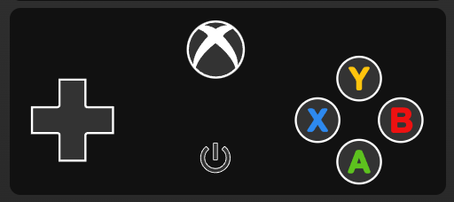

# Homekit Infused 5

## Content
- [Introduction](../index.md)
- [Installation](../installation.md)
- [Configuration](../configuration.md)
- [Addons](../addons.md)
- [Updates](../updates.md)
- [Issues & Questions](../issues.md)
- [About Me](../about.md)
- [Thanks](../thanks.md)

## Addons > Xbox Controller

This addon gives your view an Xbox Controller.

You can use any of the following options to modify your addon.

| Name | Required | Default | Description |
|----------------------------------|-------------|----------------------|-----------------------------------------------------------------------------------------------------------------------------------------------------------------------------------|
| title | no | undefined | Set the title of the stack, ommitting this line will or setting `title: hide` will hide the title |
| xbox_entity | yes | media_player.xboxone | Set your Xbox entity here, this must be in the media_player domain |
| remote_entity | yes | remote.xboxone_remote | Set your Xbox remote entity here, this must be in the remote domain |
| [view_layout](layout.md#view-layout) | no | undefined | This is best used in conjunction with the [layout](layout.md#view-layout) addon, but can also be used to control whether to show this stack on different screen sizes. |

```yaml
# views.yaml (example)
  my_view:
    addons:
      xbox:
        - title: Xbox One
          xbox_entity: media_player.xboxone
          remote_entity: remote.xboxone_remote
```               
```yaml
# views.yaml (example multiple controllers)
  my_view:
    addons:
      xbox:
        - title: Xbox One
          xbox_entity: media_player.xboxone
          remote_entity: remote.xboxone_remote
        - title: Xbox One X
          xbox_entity: media_player.xboxone_x
          remote_entity: remote.xboxone_x_remote
```   

### Images:


