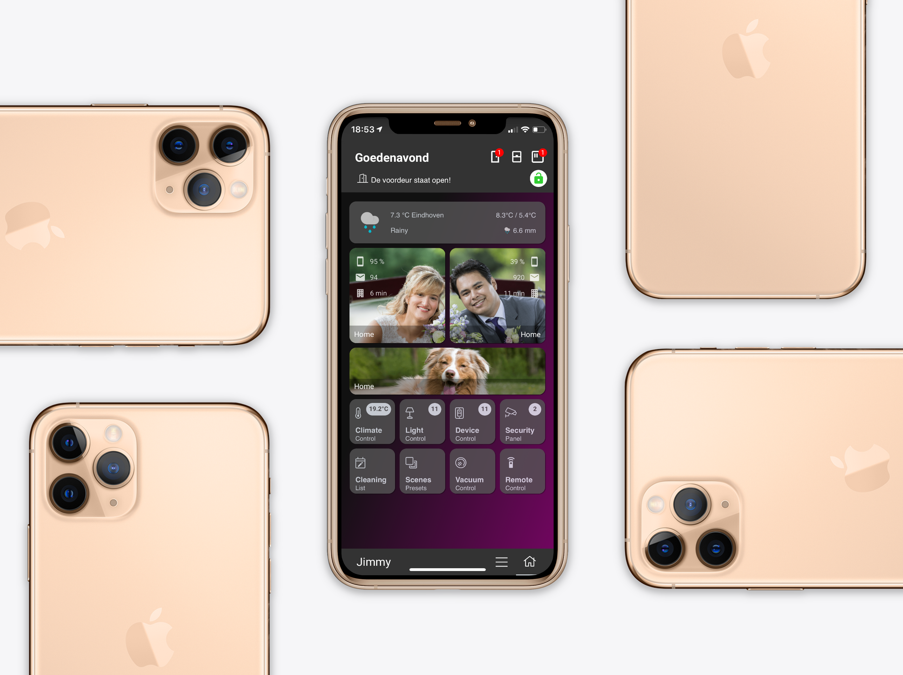
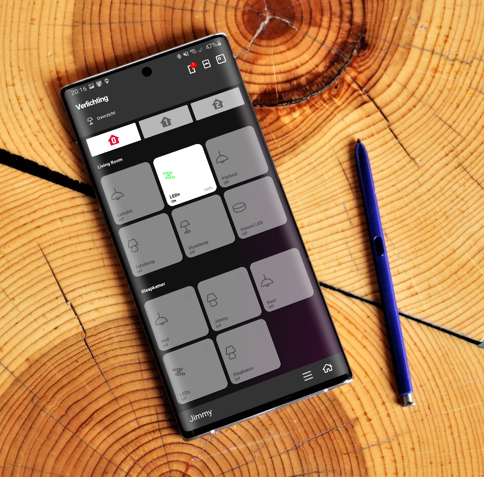
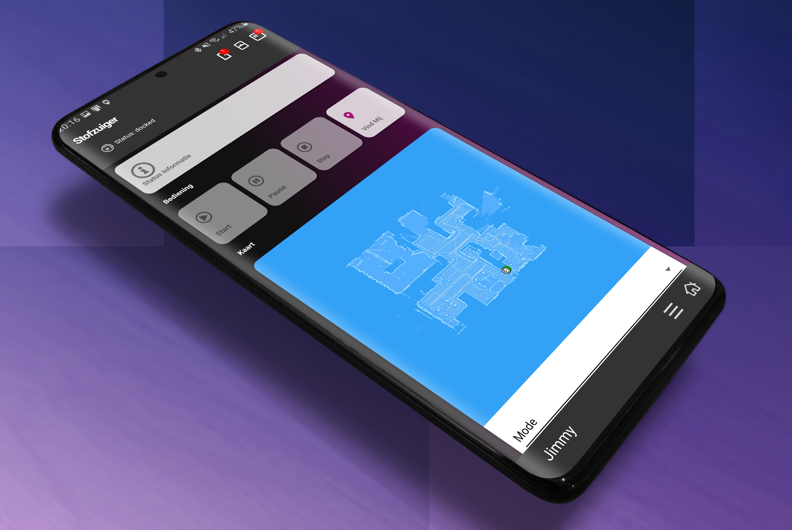
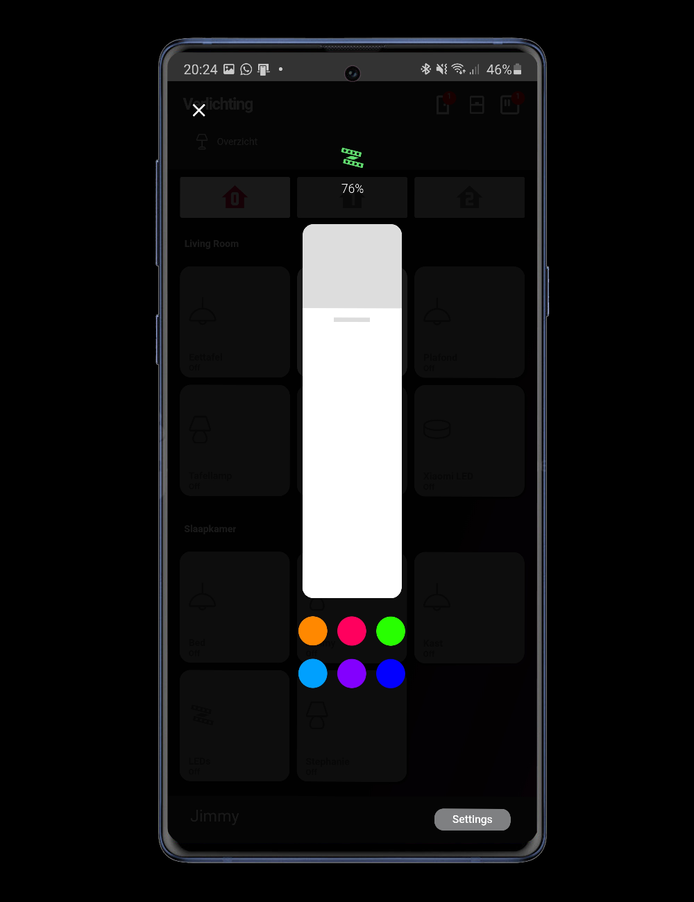

If you find any information on this page useful, feel free to buy me a coffee: 

## Homekit Infused (Lovelace) by Jimz011 April 2021 v4.0.0c Beta (*updated: 21/04/2021)
*Note: You MUST have a working Home Assistant install to use this project, you can download Home Assistant [here](https://home-assistant.io).
*Latest compatible Home Assistant version is 2021.4.x (do not update past this number for best compatibility)

### About
This is Homekit Infused aka HKI. When you come here for the first time you might be a little confused to what this is. 
Homekit Infused is in a nutshell a customizable 'framework' that you can use to build your own dashboard on, it is preconfigured to have an Apple style to it.
By default it contains the following things:
- A beautiful header with notifications that is customizable per view and is added to each view for you automatically
- A customizable navigation bar which can also be set at the bottom of the screen 
- An auto generated shortcut menu to each view
- 11 color schemes
- Shortcuts to the most common used HA items
- Choose between custom or auto-filled views (or use them both at the same time)
- An optional easy to setup auto-fill feature which will auto-fill your views completely by itself! This is really cool! This requires no coding knowledge at all, have your setup look like mine from the screenshots just by knowing your entity names and in just a few minutes!
- Custom code is split into user folders which should make creating/reading code for your view easier to understand and less cluttered
- A lot of addons that can be turned on/off at will without any coding knowledge

*Note: None of the custom-cards used in this project are made by me and every custom-card used has a reference to their original creators as well as the original link to their repo's. All contributors/donators and people that gave me the inspiration are mentioned in the docs on the last page!

### Quick Links
#### [Click here](https://jimz011.github.io/homekit-infused/) for the documentation
#### [Click here](https://github.com/jimz011/homekit-infused/releases) to download the latest release
#### [Click here](https://github.com/jimz011/homekit-infused/tree/4.x.x-docs/docs/addon_list.md) for legacy (v3.x.x) addons
#### [Click here](https://github.com/jimz011/homekit-infused/tree/4.x.x-personal/) to view how my personal Home Assistant is setup for v4.x.x

### Support Links
#### [Click here](https://www.youtube.com/jimz011) for my YouTube channel
#### [Click here](https://discord.gg/7yt64uX) to join our Discord Community with over 2000+ members
#### [Click here](https://community.home-assistant.io/t/homekit-infused-hki-v0-13-3/117086/1) for my HA Community Forum Thread

### Video and screenshots
#### Screenshots

#### Video
Coming Soon!

### Featured Theme
Dwains Dashboard is a beautiful theme created by @Dwains which can be found [here](https://github.com/dwainscheeren/lovelace-dwains-theme). I will recommend this theme as an alternative to HKI when you are using lighter hardware.
