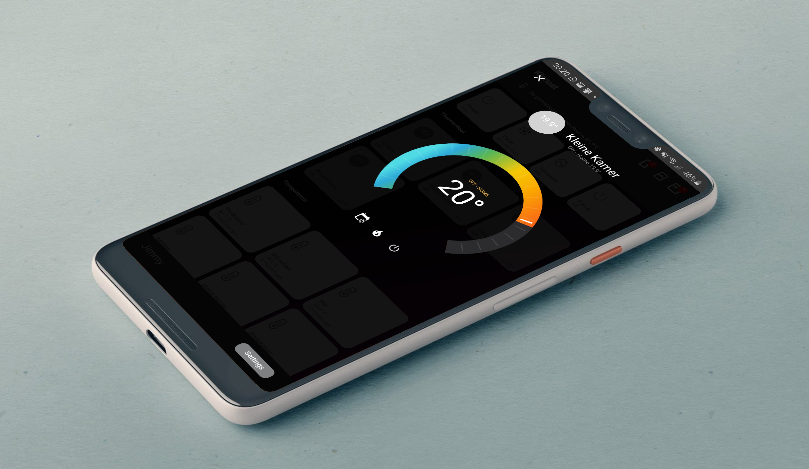

If you find any information on this page useful, feel free to buy me a coffee: 

# Homekit Infused (Lovelace) by Jimz011 May 2020 v2.0.0 Beta 8 (*updated: 02/05/2020)
My current Home Assistant version is 0.109.2

## Coming Soon! Open Beta now available!

## [Click here](https://www.youtube.com/jimz011) for my YouTube channel
### [Click here](https://jimz011.github.io/homekit-infused/) for documentation
### [Click here](https://github.com/jimz011/homekit-infused/releases) for all releases (including the current beta versions)
### [Click here](https://github.com/jimz011/homekit-infused/tree/personal) for my personal setup (Coming Soon!)
### [Click here](https://community.home-assistant.io/t/homekit-infused-hki-v0-13-3/117086/1) for my HA Community Forum Thread

#### About
Homekit Infused v2.0.0 is the craziest lovelace setup out there in YAML mode. It is 90% configurable through the Homekit Infused interface! The other 10% is still super easy to setup. Your views will be auto-filled with your own entities and all you'd need to do is set up a single file! But WAIT!!!!! There is more..........

Homekit Infused has a fully customizable UI, you can create your own frontpage layout with ease with the built-in edit mode which allows you to show/hide and add elements to the UI with a flick of a button. Most of the configuration can be done within the HKI Settings and changes done within the UI are INSTANT!!! Yes you've read it well, no restarts or lovelace refreshes required!

Updating should be relatively easy unless a major breaking change comes from the HA team. Whenever a large update will come I will make it thorough guides for you to make the update as smooth as possible. 

#### Video and screenshots
##### Screenshots

##### Video
Coming Soon!

#### Disclaimer
This project is a pretty heavy setup, I don't and never will recommend this to be used on any version of a Raspberry Pi. It will work, however your experiences may vary. To get the best out of this setup I will recommend to use at least a dual core i3 with a minimum of 4GB of RAM. I will recommend 6GB of RAM or more to get the best performance and be able to expand your setup without worrying about RAM.

### Questions and Support

Please ask any question you have on the [HA Community Forums](https://community.home-assistant.io/t/homekit-infused-hki-v0-13-3/117086/1)

#### Or join our Discord Server which I maintain with @Dwains:
[CLICK HERE](https://discord.gg/WZvK4Cb)

#### Featured Theme
Dwains Theme is a beautiful theme created by @Dwains which can be found [here](https://github.com/dwainscheeren/lovelace-dwains-theme). I will recommend this theme as an alternative to HKI when you are using lighter hardware.

#### Featured Cards and Addons
This months featured card is the Bar Card from @gluwc which can be found [here](https://github.com/custom-cards/bar-card). You can make beautiful graphs with this addon. It is currently not used within HKI, however it is included in the package so you can use it right away.

One of the great things that can be done with it is shown by the following user @noodlemctwoodle which has shared his beautiful view which can be used with HKI! You can find his repo and instructions [here](https://github.com/noodlemctwoodle/homeassistant) 
